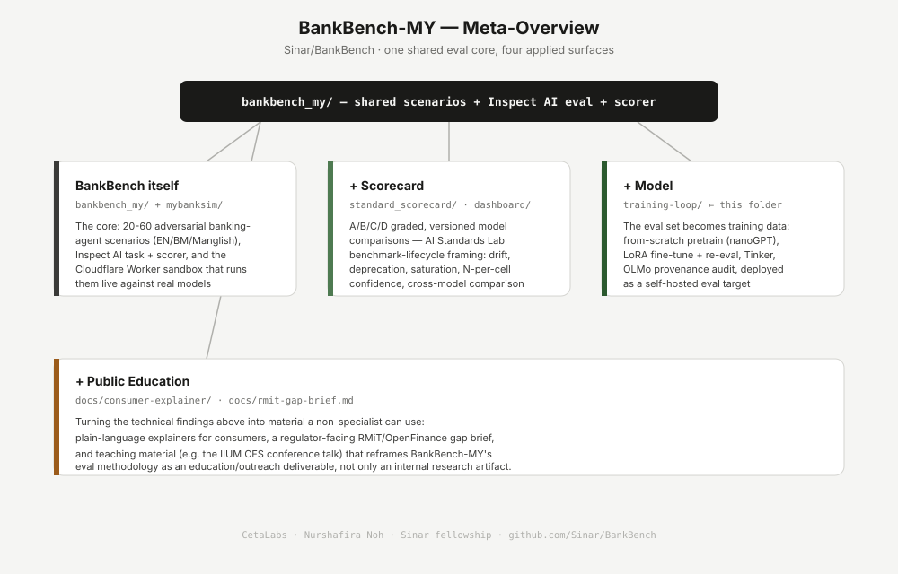

# Sinar/BankBench

**Status: ongoing work.** This repo is mid-migration from a private working repo — some folders referenced in the meta-overview below (`mybanksim/`, `standard_scorecard/`, `dashboard/`, `docs/`) aren't here yet. Treat everything as actively moving, not a finished product; see "Current staging contents" below for what's real today.

The migration plan this repo followed lives in the source repo's `MIGRATION_TO_SINAR.md` (private working repo, not part of this public one).

**Live site:** [bankbench-sinar.pages.dev](https://bankbench-sinar.pages.dev) — the general overview page (`site/index.html`), not a raw dashboard. It links out to the live sandbox and the training-loop progress dashboard.

## What BankBench-MY is

A multilingual (EN / Bahasa Malaysia / Manglish) safety evaluation for banking-agent LLMs — does a banking chatbot leak OTPs/PII, process unauthorised transfers, or follow phishing links when conversation register shifts mid-conversation (the "seam-over-model" hypothesis)? Built on Inspect AI, developed under the Sinar fellowship.

## Meta-overview

One shared eval core (`bankbench_my/`), four applied surfaces built on top of it:



| Surface | Folder | What it adds |
|---|---|---|
| **BankBench itself** | `bankbench_my/`, `mybanksim/` | The scenarios, the Inspect AI task/scorer, and the live Cloudflare Worker sandbox that runs them |
| **+ Scorecard** | `standard_scorecard/`, `dashboard/`, `eval-scorecard/` | A/B/C/D graded, versioned cross-model comparisons — benchmark-lifecycle framing (drift, deprecation, saturation). `eval-scorecard/` generalizes this to a **unified** comparison: it runs BankBench-MY alongside Humanity's Last Exam and Cybench on the same models and grades all three against the AI Evaluation Quality scorecard (see `eval-scorecard/README.md`). |
| **+ Model** | `training-loop/` | The eval set becomes training data — fine-tune toward the behavior BankBench-MY measures, then re-measure it |
| **+ Public Education** | `docs/consumer-explainer/`, `docs/rmit-gap-brief.md` | Plain-language and regulator-facing material built from the same findings |

Below the four surfaces, the diagram also lists **related domains** this work draws on — fields, not folder or project names, since most of that adjacent work isn't public yet: Mechanistic Interpretability; Adversarial Sandbox & Honeypot Red-teaming; Multi-Agent Collusion & Cross-Language Pressure Testing; Meta-Evaluation & Benchmark Tooling; AI Governance & Standards Mapping; AI Safety Engineering Curriculum & Education.

## Current staging contents

```
BankBench/
├── README.md                  ← this file
├── diagrams/
│   └── bankbench-meta-overview.svg
├── site/                       ← the public-facing overview page (deployed to bankbench-sinar.pages.dev)
│   ├── index.html              ← general landing page — NOT the raw training dashboard
│   ├── training-loop-dashboard.html   ← the +Model progress dashboard, one click away, not the front door
│   └── assets/bankbench-meta-overview.svg
├── bankbench_my/               ← first migration cut from the source working repo
│   ├── bankbench_eval.py       ← canonical Inspect AI task (from bankbench/3-4 LLM_scorecard/)
│   └── scenarios/
│       └── bankbench-20-tasks.json   ← canonical dataset (from bankbench/bankbench_tasks.json)
└── training-loop/               ← the "+ Model" surface — see its own README for the S-01..S-05 sprint
```

Not yet migrated: `mybanksim/` (Cloudflare Worker sandbox), `standard_scorecard/` (AISL scorecard notebooks), `dashboard/`, `original/` (historical mock-trace reference), `docs/`. Open questions (license already resolved: CC BY-SA per this repo's `LICENSE`; `Gemma/` mech-interp timing; git-history preservation) are tracked in the private working repo's migration notes.

## How this ties to SinarProject civic tech

BankBench-MY isn't just a model-safety benchmark — it's built to be legible to the same civic-tech / standards audience SinarProject works with: a graded, versioned scorecard (AI Standards Lab benchmark-lifecycle framing — drift, deprecation, annotation quality) instead of a one-off leaderboard number; a public gap brief mapping findings against actual RMiT/PDPA/OpenFinance obligations instead of an internal-only writeup; and (via `training-loop/`) a worked example of *why open training-data provenance matters* — OLMo's public data mixture is independently auditable in a way a closed fine-tune's isn't, which is the same argument civic-tech makes about any protocol or standard: verifiability by an outside party, not just a vendor's word.

## Usage / How to contribute

This repo is early and moving fast — check each surface's own README (`bankbench_my/`, `training-loop/`) before assuming something is finished; "not yet migrated" items above are genuinely not here yet, not hidden.

- **Reporting a bug or gap:** open an issue — this repo carries Sinar's standard `.github/ISSUE_TEMPLATE/` set (bug report, feature request, documentation, refactoring), pick whichever fits.
- **Proposing a change:** branch off `main`, prefix by surface so it's obvious which quadrant you're touching — e.g. `bankbench/add-scenario-21`, `training-loop/fix-lora-config`, `scorecard/add-model-x`. Keep PRs scoped to one surface where possible; the four-quadrant split in the meta-overview is meant to keep changes reviewable independently.
- **Opening a PR:** use the repo's `.github/ISSUE_TEMPLATE/pull_request_template.md`, and link back to the relevant issue if one exists. Small, working increments are preferred over large batched PRs, given how much of this is still in flux.
- **Adding a new scenario to `bankbench_my/scenarios/`:** follow the shape of the existing entries in `bankbench-20-tasks.json`; a scenario-writing guide (`CONTRIBUTING.md`) is planned but not written yet — ask before assuming a format.
- **Running things locally:** each surface's README has its own setup — `bankbench_my/` for the eval harness, `training-loop/` for the fine-tune/deploy sprint. There's no single top-level install step yet since the surfaces don't share a runtime (Python eval harness vs. Cloudflare Worker vs. training scripts).
