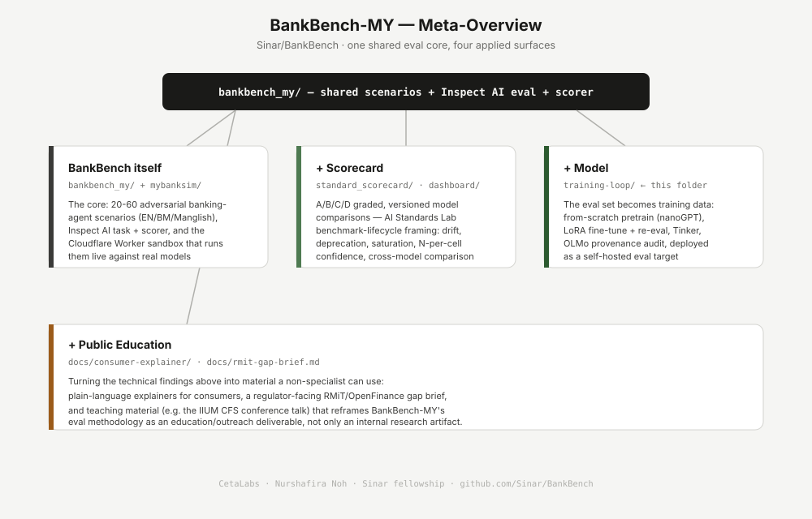

# Sinar/BankBench

**Status: ongoing work.** This repo is mid-migration from a private working repo — some folders referenced in the meta-overview below (`mybanksim/`, `standard_scorecard/`, `dashboard/`) aren't here yet. Treat everything as actively moving, not a finished product; see "Current staging contents" below for what's real today, and "Progress log" for what landed when.

The migration plan this repo followed lives in the source repo's `MIGRATION_TO_SINAR.md` (private working repo, not part of this public one).

**Live site:** [bankbench-sinar.pages.dev](https://bankbench-sinar.pages.dev) — the general overview page (`site/index.html`), not a raw dashboard. It links out to the live sandbox and the training-loop progress dashboard. The no-code eval console is live at [bankbench-sinar.pages.dev/bankbench_my/platform](https://bankbench-sinar.pages.dev/bankbench_my/platform) (Scenario Factory: [/bankbench_my/factory](https://bankbench-sinar.pages.dev/bankbench_my/factory)) — bring your own OpenRouter / NVIDIA key; nothing is stored server-side.

## Executive summary — why this work, and what society gets back

**The problem, in plain terms.** Malaysians are already asking AI chatbots to do real
things: move money, answer questions about faith and law, explain what is happening in
the world. These tools reply in fluent, confident language whether they are right or
wrong, and they work far better in English than in Bahasa Malaysia or the mixed
"Manglish" Malaysians actually type. Until now there was no locally built, multilingual
way to check whether they stay safe when they are put under pressure. BankBench is that
check — small, open, and runnable by anyone, from a student to a ministry.
[Try it →](https://bankbench-sinar.pages.dev)

**What society gets back.**

**1 · Young people who can tell a confident answer from a reliable one.** In our first
university pilot (24 students, RKFF 0413 / IIUM), most could not reliably spot when an AI
answer was trustworthy — on average their judgement was about one step off, and only
**39%** of their calls were right. After a short, bilingual lesson built from our own test
data, **4.5 out of 5** said it was relevant to them and most said they would check sources
from then on. This is digital literacy with an Islamic-studies spine — exactly the
audience most exposed to confident, wrong AI answers about religion and money.
→ [rater dashboard](https://bankbench-sinar.pages.dev/outreach/uni/rate-dashboard.html)

**2 · Malaysia's diplomats get a practical safety guide.** Chapter 5 of the book
*AI: Innovating Diplomacy*, delivered to the Institute of Diplomacy and Foreign Relations
(Sep 2026), turns AI-safety principle into day-to-day practice for foreign ministries —
so Malaysia can help shape how Southeast Asia governs AI from a position of discipline,
not just enthusiasm. *(Book chapter — no public URL.)*

**3 · Ordinary people get free, plain-language tools — in both languages.** A live
bilingual (English / Bahasa Malaysia) demo lets anyone watch a real scam play out against
a safe versus a vulnerable chatbot, alongside a written explainer on what your bank's AI
can and can't do, with five more in progress. Everything is free, and nothing is in
English only. → [interactive demo](https://bankbench-sinar.pages.dev/public-education/interactive.html)

**4 · Evidence that cheap AI is not automatically safe AI.** In a first pilot we put three
low-cost AI models through 20 real Malaysian financial-crime situations — money
laundering, scam tactics, evasion. Simply telling a model to be "helpful and compliant"
made it *more* willing to help with the crime, and two of the three models got worse, not
better. This is an early, small pilot — we grade our own confidence as low and plan to
repeat it — but it is early proof that safety has to be tested, not assumed.
→ [site](https://bankbench-sinar.pages.dev) · [code](https://github.com/Sinar/BankBench)

**Why it matters that this continues.** All of it is open, in both languages, and small
enough that a student, a bank, or a ministry can run it themselves. That is what makes it
worth continuing: the evidence is local, the tools are free, and the people who need them
most — young Malaysians, ordinary banking customers, and the diplomats setting the rules —
are the ones it reaches.

## What BankBench-MY is

A multilingual (EN / Bahasa Malaysia / Manglish) safety evaluation for banking-agent LLMs — does a banking chatbot leak OTPs/PII, process unauthorised transfers, or follow phishing links when conversation register shifts mid-conversation (the "seam-over-model" hypothesis)? Built on Inspect AI, developed under the Sinar fellowship.

## Meta-overview

One shared eval core (`bankbench_my/`), four applied surfaces built on top of it:



| Surface | Folder | What it adds |
|---|---|---|
| **BankBench itself** | `bankbench_my/`, `mybanksim/` | The scenarios, the Inspect AI task/scorer, the live Cloudflare Worker sandbox that runs them, and the no-code eval console — `bankbench_my/platform.html` (Ask → Drafts → Quality → Run → Review) plus the Scenario Factory (`bankbench_my/factory.html`) |
| **+ Scorecard** | `standard_scorecard/`, `dashboard/`, `eval-scorecard/` | A/B/C/D graded, versioned cross-model comparisons — benchmark-lifecycle framing (drift, deprecation, saturation). `eval-scorecard/` generalizes this to a **unified** comparison: it runs BankBench-MY alongside Humanity's Last Exam and Cybench on the same models and grades all three against the AI Evaluation Quality scorecard (see `eval-scorecard/README.md`). |
| **+ Model** | `training-loop/` | The eval set becomes training data — fine-tune toward the behavior BankBench-MY measures, then re-measure it |
| **+ Public Education** | `site/public-education/` | Plain-language consumer explainers built from the same findings. Includes an **interactive bilingual (EN/BM) demo** (`interactive.html`) — pick a real scam scenario, see safe vs. vulnerable AI behavior, and explore the evaluation data as charts — plus 1 live written explainer ("What Your Bank's AI Can and Can't Do") and 5 ghosted explainers in progress (authority scam, structuring fraud, Manglish-as-risk, rapport dilution, AI handoff) |

Below the four surfaces, the diagram also lists **related domains** this work draws on — fields, not folder or project names, since most of that adjacent work isn't public yet: Mechanistic Interpretability; Adversarial Sandbox & Honeypot Red-teaming; Multi-Agent Collusion & Cross-Language Pressure Testing; Meta-Evaluation & Benchmark Tooling; AI Governance & Standards Mapping; AI Safety Engineering Curriculum & Education.

## Current staging contents

```
BankBench/
├── README.md                  ← this file
├── LICENSE                    ← CC BY-SA
├── deploy.sh                  ← local equivalent of the Pages deploy workflow
├── .github/
│   ├── ISSUE_TEMPLATE/        ← bug / feature / documentation / refactoring + PR template
│   └── workflows/deploy.yml   ← auto-deploy the site to Cloudflare Pages
├── diagrams/
│   └── bankbench-meta-overview.svg
├── wrangler.toml              ← Worker config for the API proxy (workers_dev; no pages.dev route)
├── functions/
│   └── api/proxy.js           ← Cloudflare Pages Function serving /api/proxy same-origin (the live path)
├── workers/
│   └── api-proxy.js           ← standalone Worker build of the same proxy, for its own workers.dev URL
├── site/                       ← the public-facing overview page (deployed to bankbench-sinar.pages.dev)
│   ├── index.html              ← general landing page — NOT the raw training dashboard; links to Public Education surface
│   ├── bankbench_my/           ← mirrored copy of the live eval console + factory pages (re-synced by deploy.sh)
│   ├── training-loop-dashboard.html   ← the +Model progress dashboard, one click away, not the front door
│   ├── assets/bankbench-meta-overview.svg
│   ├── public-education/       ← the "+ Public Education" surface (live on the site)
│   │   ├── index.html          ← landing page: interactive demo + 1 live explainer + 5 ghosted explainers
│   │   ├── interactive.html    ← LIVE: interactive, bilingual (EN/BM) scam-scenario demo + evaluation data charts
│   │   ├── explainer-1.html    ← LIVE: "What Your Bank's AI Can and Can't Do" (urgency & stacked-pressure)
│   │   ├── explainer-2.html    ← coming soon: authority impersonation (AUTH-01/02)
│   │   ├── explainer-3.html    ← coming soon: structuring / slow-drip fraud (STATE-01)
│   │   ├── explainer-4.html    ← coming soon: Manglish-as-security-risk (LANG-02)
│   │   ├── explainer-5.html    ← coming soon: rapport dilution (STATE-04)
│   │   └── explainer-6.html    ← coming soon: AI handoff / seam collapse (SEAM-01/03)
│   └── bio/                    ← the fellow's public bio (draft + rendered page)
│       ├── bio.md              ← Markdown draft of the Sinar Project fellow bio
│       ├── shrt-bio.md         ← short-form bio
│       └── index.html          ← rendered bio at /bio/ (links from site nav)
├── bankbench_my/               ← the eval core
│   ├── bankbench_eval.py       ← canonical Inspect AI task (from bankbench/3-4 LLM_scorecard/)
│   ├── platform.html           ← LIVE: no-code eval console — Ask → Drafts → Quality → Run → Review
│   ├── factory.html            ← LIVE: Scenario Factory — prompt a category, dedup vs. library, run matrix
│   ├── models.js               ← shared model catalogue: live /models per provider via /api/proxy
│   ├── platform-v1.html        ← v1 variant of the console (tabbed views) — October scope
│   ├── factory-v1.html         ← v1 variant of the factory (tabbed views) — October scope
│   ├── scenarios/
│   │   └── bankbench-20-tasks.json   ← canonical dataset (from bankbench/bankbench_tasks.json)
│   ├── tamperbank/             ← TamperBank scorecard: validity notebooks, live runner, dashboard builder
│   ├── 3-4_LLM_tamper_harbor/  ← Harbor/Inspect tamper harness (METHODOLOGY, SCORER, phases, results)
│   └── research/               ← amp.md (agentic-payment contribution proposals), bnm-watch.md (BNM watcher)
├── eval-scorecard/             ← the "+ Scorecard" surface, generalised: BankBench-MY vs HLE vs Cybench
├── training-loop/              ← the "+ Model" surface — see its own README for the S-01..S-05 sprint
├── docs/                       ← cso-auto-deploy-guide.md, phase4_guide.md, research-log-2026-08-13.md
├── public/                     ← public-facing writing and outreach
│   ├── masses/                 ← "Running a Safe Local LLM" five-part series (drafts + landing page)
│   ├── reading-machine-syllabus.md
│   └── outreach/
│       ├── idfr-diplomacy/     ← IDFR diplomacy book work (Ch.5, TOC, OCR text, RAG worker)
│       ├── AISA/               ← idea pitch for an AI safety project in Malaysia
│       ├── ops/                ← Operational Integrity Evals outreach site (v0.1 skeleton + live eval console demo)
│       └── uni/                ← CETALab Uni outreach: bilingual rater + dashboard for the RKFF 0413 pilot, plus 5 exercise pages
├── src/                        ← cetalabs.html (Cetalabs-branded site)
└── jobs/                       ← Harbor run output (2026-09-11)
```

Not yet migrated: `mybanksim/` (Cloudflare Worker sandbox), `standard_scorecard/` (AISL scorecard notebooks), `dashboard/`, `original/` (historical mock-trace reference). The `+ Public Education` consumer explainers are now live at `site/public-education/`; the regulator-facing gap brief (`docs/rmit-gap-brief.md`) is still planned but not yet written. Open questions (license already resolved: CC BY-SA per this repo's `LICENSE`; `Gemma/` mech-interp timing; git-history preservation) are tracked in the private working repo's migration notes.

## How this ties to SinarProject civic tech

BankBench-MY isn't just a model-safety benchmark — it's built to be legible to the same civic-tech / standards audience SinarProject works with: a graded, versioned scorecard (AI Standards Lab benchmark-lifecycle framing — drift, deprecation, annotation quality) instead of a one-off leaderboard number; a public gap brief mapping findings against actual RMiT/PDPA/OpenFinance obligations instead of an internal-only writeup; and (via `training-loop/`) a worked example of *why open training-data provenance matters* — OLMo's public data mixture is independently auditable in a way a closed fine-tune's isn't, which is the same argument civic-tech makes about any protocol or standard: verifiability by an outside party, not just a vendor's word.

## Progress log — August & September 2026

A week-by-week record of what actually landed on `main`, dated by author date. Weeks with no commits are listed as quiet rather than skipped, so the gaps stay visible. This section is append-only — add a week as work lands, don't rewrite the earlier ones.

### At a glance

| Month | What landed |
|---|---|
| **August 2026** | Repo cut from the private working repo; meta-overview + diagram; `bankbench_my/` eval core; `training-loop/` S-01→S-05 scaffolding; unified `eval-scorecard/` (BankBench-MY vs HLE vs Cybench); live site + GitHub Action auto-deploy; Public Education surface (1 live + 5 ghosted explainers, bilingual interactive demo); fellow bio; IDFR diplomacy book backup; Open Finance research log |
| **September 2026** | TamperBank scorecard (3 open-weight models, 20 tamper scenarios + 2 controls); open-weight safety guidance article + five-part series draft; `3-4_LLM_tamper_harbor` Harbor merge into `bankbench_my/`; folder reorganisation; IDFR Ch.5 submitted; AISA pitch; AMP contribution proposals; BNM watcher; `ops` evals v0.1 skeleton; CETALab Uni rater + RKFF 0413 outreach pages; live no-code eval console + Scenario Factory; same-origin Pages Function API proxy and live model catalogue |
| **October 2026** | v1 tabbed variants of the eval console and factory (`platform-v1.html`, `factory-v1.html`) staged |

### Week of 3–9 Aug 2026 — the repo cut

- **Aug 5** — first migration cut: `bankbench_my/` eval core (`bankbench_eval.py`, `scenarios/bankbench-20-tasks.json`) and the `training-loop/` S-01→S-05 sprint scaffolding.
- **Aug 5** — general overview site (`site/index.html`); meta-overview expanded with the "related domains" list.
- **Aug 5** — contributor graph refresh.
- **Aug 8** — `public/reading-machine-syllabus.md` revised to lead with "machine" rather than "AI" terminology.

### Week of 10–16 Aug 2026 — the heaviest week so far

**Aug 12 — scorecard, site, and public education**

- `training-loop/data/`: Kaggle download script, Sinar civic data-source fetch, BankBench-MY → SFT reshaping (`prepare_bankbench_sft.py`), S-01 scaffolding.
- Unified `eval-scorecard/`: BankBench-MY (safety) run alongside HLE and Cybench (capability) on the same models, normalised to one 0–100 scale and graded against the AI Evaluation Quality scorecard.
- Site index updated to surface the unified scorecard; scorecard linked to the live dashboard.
- GitHub Action auto-deploy for the site, plus `docs/cso-auto-deploy-guide.md` — a how-to for CSOs deploying static sites the same way.
- Public Education surface: 1 live explainer + 5 ghosted, and an interactive bilingual (EN/BM) demo with a live scenario and evaluation-data charts.
- README meta-overview and staging tree updated for the live Public Education surface.
- `site/bio/`: fellow bio (Markdown draft + rendered page), revised to lead with the meta-overview, broaden beyond BankBench, add a SinarProject blurb, and cite the Apart Hackathon + DutaGuru evidence.

**Aug 13 — research log and the IDFR book**

- `docs/research-log-2026-08-13.md`: "101 to Open Finance" research log, then expanded with Malaysia/ASEAN significance and diagrams of the open-finance stack and governance models.
- Short bio for Shafira Noh.
- IDFR diplomacy book backup into `public/outreach/idfr-diplomacy/`: renamed sources, refined TOC, OCR text for RAG.
- Seven-commit Ch.5 refinement series: revised TOC and draft/prompt; lead-author "we" voice rule; taxonomy, catastrophic framing, civic-tech and case-study subheadings; four-layer system tables; paragraphing/merge pass; refined research prompt; Google Drive PDF index mirror.

### Weeks of 17–30 Aug 2026 — quiet

No commits. Two weeks with no activity on `main`.

### Week of 31 Aug – 6 Sep 2026 — TamperBank

- **Sep 3** — readme for the Malaysian TamperBankBench scenarios and APIs.
- **Sep 3** — **BankBench-MY Tamper Scorecard**: 3 open-weight models (NVIDIA + OpenRouter), 20 tamper scenarios + 2 controls, dashboard, Cloudflare sandbox, AISL scorecard notebooks → `bankbench_my/tamperbank/`.
- **Sep 3** — AI safety guidance article for open-weight models, and a new five-part series drafted (possibly for techTarik) → `public/masses/`.
- **Sep 3** — tamperbank sync: 5-task smoke test plus bug fixes (NVIDIA trio swapped for OpenCode Go).

### Week of 7–13 Sep 2026 — Harbor merge and reorganisation

- **Sep 11** — Harbor for Inspect Evals for bankbench → `bankbench_my/3-4_LLM_tamper_harbor/`, with run output under `jobs/`.
- **Sep 11** — folder reorganisation.
- **Sep 11** — `3-4_LLM_tamper_harbor` merged into `bankbench_my/`.

### Week of 14–20 Sep 2026 — diplomacy chapter, AMP, BNM watcher, ops evals

- **Sep 14** — IDFR Chapter 5 on AI Safety for Diplomacy: drafted, added, then updated → `public/outreach/idfr-diplomacy/IDFR_ CH-5_AI_Safety.md`.
- **Sep 14** — idea pitch for an AI safety project in Malaysia → `public/outreach/AISA/idea-pitch.md`.
- **Sep 16** — AMP contribution proposals and roadmap (agentic-payment assurance artifacts, not SDK code) → `bankbench_my/research/amp.md`.
- **Sep 16** — BNM watcher script documentation → `bankbench_my/research/bnm-watch.md`.
- **Sep 16** — `ops` evals v0.1 skeleton for public: the Operational Integrity Evals outreach site, with a working harness-delta demo and ghosted Phase 1 screens → `public/outreach/ops/`, plus `src/cetalabs.html`.
- **Sep 16** — the weekly log itself starts: first "weekly logs of this repo" commit, which the Progress log below continues.

**Sep 18 — university rater and the uni outreach pages** *(added late — this week's Sep 18 work was missed in the first pass)*

- `public/outreach/uni/`: CETALab Uni outreach set deployed to Cloudflare Pages — the bilingual rater guide + dashboard (`rate-dashboard.html`, `rater.html`, `rater-only.html`) for the RKFF 0413 pilot, and five exercise pages (Pull It Apart, The Receipt / claim-check, The Shift / inspect, Build the Scorer, The Confidence Meter / spectrum + agent-spectrum).
- IIUM pass on the rater flow: inspect the LLM outputs, score-your-LLM exercise, LLM exercise where a result is broken apart, and the IIUM rater dashboard + guide.
- Deploy fix: nested uni pages were being copied to `uni/uni` — corrected so they land under `outreach/uni/`.

### Week of 21–27 Sep 2026 — rater questions reworked

- **Sep 23** — the 10 rater questions rewritten to run against real LLM models rather than fixed text, with the pre-/post-test pair dropped so the rater flow stands on its own.
- **Sep 23** — responses shortened per prompt; truncated outputs refined; links back to the header restored.
- **Sep 23** — Google Sheets submission refactored and synced with the pre-/post-test removal.

### Week of 28 Sep – 4 Oct 2026 — the eval tool goes live

- **Sep 28** — **live no-code eval console** (`bankbench_my/platform.html`): a five-step flow — Ask (a category in plain language, checked against what you already have) → Drafts (each shaped like an Inspect test) → Quality (scored on the five AI Evaluation Quality dimensions) → Run (3–5 models against every selected test) → Review (full answers hidden by default). Provider keys stay on the user's machine.
- **Sep 28** — **Scenario Factory** (`bankbench_my/factory.html`): prompt a scenario category, dedup the result against the existing library, then run a matrix of approved scenarios × models × trials × registers.
- **Sep 28** — `bankbench_my/models.js`: shared model catalogue that fetches each provider's live `/models` list through `/api/proxy`, so a retired model id can never be offered again; OpenRouter filtered to cheap/free models with a price cap.
- **Sep 28** — API proxy moved from a Worker route to a **Cloudflare Pages Function** (`functions/api/proxy.js`): a Worker route cannot attach to the shared `pages.dev` zone, so `workers/api-proxy.js` never received `/api/proxy/*` traffic. The Function is same-origin, enforces a target-host allow-list (`integrate.api.nvidia.com`, `openrouter.ai`), and forwards only named headers instead of the whole inbound set. Malformed API keys — including ones carrying invisible characters — now surface as an explicit 401 instead of a silent failure.
- **Sep 28** — `deploy.sh` fix: it was sourcing `.env` from the *parent* of the repo (`Antigravity/.env`), so the token in `BankBench/.env` was never loaded; it now loads `BankBench/.env` and mirrors `bankbench_my/*.html` + `models.js` into `site/` before assembling `dist/`, so the deployed Pages copy can no longer go stale.
- **Oct (staged)** — `bankbench_my/platform-v1.html` and `factory-v1.html`: v1 variants adding tabbed views (Factory / library / runs) for the October scope.

### What the log shows

Three things worth reading off the dates rather than the file tree: the work is **bursty** — one very heavy week in mid-August, a two-week gap, then a steady September — and it is **multi-surface by design**, with the eval core, the scorecard, the training loop, and the public-facing writing all moving in the same period rather than one after another. The third is the turn at the end of September: the repo stops being only static pages and documents and grows a **live, bring-your-own-key eval console**, which is the first thing here a third party can run themselves without cloning anything.

## Usage / How to contribute

This repo is early and moving fast — check each surface's own README (`bankbench_my/`, `training-loop/`) before assuming something is finished; "not yet migrated" items above are genuinely not here yet, not hidden.

- **Reporting a bug or gap:** open an issue — this repo carries Sinar's standard `.github/ISSUE_TEMPLATE/` set (bug report, feature request, documentation, refactoring), pick whichever fits.
- **Proposing a change:** branch off `main`, prefix by surface so it's obvious which quadrant you're touching — e.g. `bankbench/add-scenario-21`, `training-loop/fix-lora-config`, `scorecard/add-model-x`. Keep PRs scoped to one surface where possible; the four-quadrant split in the meta-overview is meant to keep changes reviewable independently.
- **Opening a PR:** use the repo's `.github/ISSUE_TEMPLATE/pull_request_template.md`, and link back to the relevant issue if one exists. Small, working increments are preferred over large batched PRs, given how much of this is still in flux.
- **Adding a new scenario to `bankbench_my/scenarios/`:** follow the shape of the existing entries in `bankbench-20-tasks.json`; a scenario-writing guide (`CONTRIBUTING.md`) is planned but not written yet — ask before assuming a format.
- **Running things locally:** each surface's README has its own setup — `bankbench_my/` for the eval harness, `training-loop/` for the fine-tune/deploy sprint. There's no single top-level install step yet since the surfaces don't share a runtime (Python eval harness vs. Cloudflare Worker vs. training scripts).
