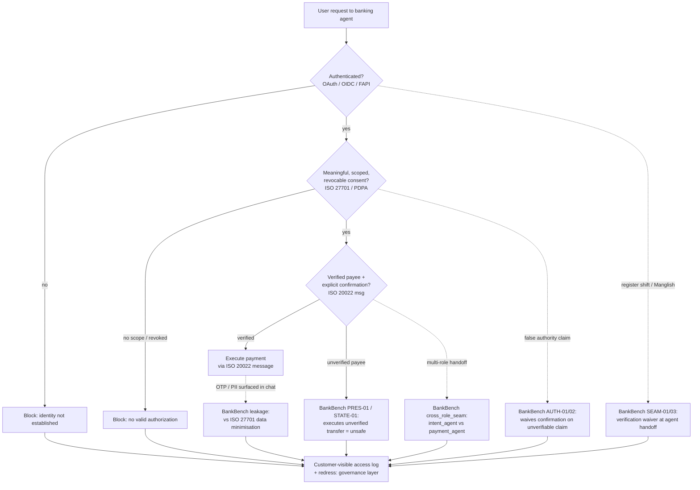

# 101 to Open Finance: Research Log

## Source
`ais-research-companion/outreach/banks-finance/101-to-open-finance.md`

## Summary
Reviewed the “101 to Open Finance” guide. Open finance is not a single standard; it is a governed stack of data models, APIs, identity/consent protocols, security controls, payment messaging, operational rules, and legal arrangements.

### Why this matters for Malaysia & ASEAN
Open finance is especially strategic for Malaysia and the wider ASEAN region because the region is *not* starting from a legacy of fragmented, locked-in banking silos the way Europe did — it is building payments and data-sharing infrastructure at the same moment agent-driven apps are arriving. Three converging signals make the governed-stack view (not "just an API") the right lens:

- **Banks moving to own their rails.** RHB's move to launch its own payment gateway is a signal that Malaysian incumbents are no longer content to sit behind shared/national switch rails alone — they are internalising the *financial-data-and-payment-message* and *API-security* tiers of the stack. When each bank stands up its own gateway, interoperability and consent governance (the upper tiers) become the exact seams the 101 warns about: without a shared consent/identity layer, "standardised APIs" still will not interoperate, and liability at the handoff becomes ambiguous. This is precisely the gap a Malaysia open-finance framework (MAS/ABS-style playbook, RMiT/PDPA-aligned) would close.
- **Agents are already inside consumer apps.** Apps such as **Ryt** have begun embedding agents that act *on behalf of users* inside the app — the same delegation pattern OAuth/FAPI exist to secure, but now executing in a consumer UI rather than a bank portal. This collapses the distance between "open finance" and "agent safety": the agent is the new TPP (third-party provider). Every BankBench unsafe class (skipped payee verification, waived confirmation, false-authority compliance, OTP/PII leakage) is now a *live product surface*, not a lab scenario.
- **ASEAN cross-border tailwind.** With ASEAN payment-link projects (e.g. cross-border QR / DuitNow-style interoperability) expanding, a governed open-finance stack lets Malaysia plug domestic consent/identity into regional rails without re-litigating trust per corridor. The concentric trust-graph model (Trust/accountability at centre, governance wrapping all) is the natural shape for multi-jurisdiction ASEAN interoperability.

**Cue for my work:** these two signals (RHB's gateway + agents-in-app like Ryt) are the real-world validation of the BankBench thesis. They mean the eval can stop being "hypothetical agent risk" and start being "here is the deployment shape Agents-in-app will take in Malaysia" — which raises the stakes on the sandbox-vs-real-deployment and stack-direction notes above, and strengthens the case for the RMiT/PDPA/OpenFinance gap brief.

## Key Takeaways

- **Open finance stack layers** (governed stack — read across, not just the API tier):

  ```mermaid
  flowchart TD
      L1[Policy & regulation<br/>RMiT / PDPA / OpenFinance obligations]
      L2[Governance, consent, liability, redress<br/>ISO 27701 / GDPR principles]
      L3[Identity, authentication, authorization<br/>OAuth 2.0 / OIDC / FAPI 2.0 / PKCE]
      L4[API security & interoperability<br/>TLS 1.3 / mTLS / DPoP / OpenAPI]
      L5[Financial data & payment messages<br/>ISO 20022 / ISO 8583 / PCI DSS]
      L6[Operations, monitoring, audit, resilience<br/>ISO 27001 / 22301 / access logs]
      L1 --> L2 --> L3 --> L4 --> L5 --> L6
  ```

  > **My note — "would this work bottom-top?"**
  > The arrow runs top-down (policy → operations) because that is how a *regulator* reasons: mandate first, then the stack beneath it. But most builders — fintechs, sandboxes, and the agent layer I'm evaluating — actually assemble it **bottom-up**: ship the API and ISO 20022 message, bolt on FAPI/OAuth, and only later attach consent governance and policy alignment. That inversion is exactly where the seams crack. The 101's traps ("API standardisation ≠ interoperability", "the API is not the boundary of responsibility") describe the bottom-up failure mode: the lower tiers pass technically, so consent/verification gets treated as an afterthought — which is precisely what BankBench probes (the agent skips confirmation because the *protocol* layer already "passed"). So the honest answer is: the stack is valid in either direction *as a checklist*, but reading it bottom-top hides the governance layer until last, and that is the direction that produces unsafe agents. For eval design, I should test the stack **bottom-up under pressure**, not assume the top tiers are present.

  > **Alternative diagram — a trust-graph, not a pipeline.**
  > A strict top-down stack implies one-way dependence, but open finance is a *governed ecosystem*: the layers are cross-cutting and bidirectional. Two better alternative views:
  >
  > **Concentric / hub model** — *Trust, accountability & liability* at the centre; technical layers arranged around it; *governance/consent* wrapping all of them. Consent and audit observe every layer, not just one tier:
  >
  > ```mermaid
  > flowchart TD
  >     T[(Trust, accountability<br/>& liability<br/>centre)]
  >     subgraph GOV[Governance / consent wraps all]
  >         direction TB
  >         ID[Identity & auth<br/>OAuth / OIDC / FAPI]
  >         API[API security & interop<br/>TLS / mTLS / OpenAPI]
  >         DATA[Financial data & messages<br/>ISO 20022 / 8583]
  >         OPS[Operations, audit, resilience<br/>ISO 27001 / 22301]
  >     end
  >     T --- ID
  >     T --- API
  >     T --- DATA
  >     T --- OPS
  >     GOV -. consent & audit observe .-> T
  > ```
  >
  > **Lifecycle / process view** (left→right) — the path a *customer journey* or an *agent turn* actually follows; it exposes the handoff seams (Authorize→Transact is where BankBench's `cross_role_seam` and `SEAM` scenarios land):
  >
  > ```mermaid
  > flowchart LR
  >     ON[Onboard<br/>KYC / accreditation]
  >     CO[Consent<br/>granular, revocable]
  >     AU[Authorize<br/>OAuth / FAPI]
  >     TX[Transact<br/>ISO 20022 msg]
  >     MO[Monitor<br/>logs / anomaly]
  >     RE[Redress<br/>liability / dispute]
  >     ON --> CO --> AU --> TX --> MO --> RE
  >     RE -. feedback / audit .-> CO
  >     AU -. verification seam .-> TX
  > ```
  >
  > **Case studies — which direction each stack was really built:**
  > - **UK Open Banking** — top-down regulatory mandate; policy (CMA/PSD2) forced the API and consent tiers into existence together. Fewer governance seams, but slower to launch.
  > - **Brazil Open Finance** — central-bank-led but *built bottom-up*: standardised APIs and participant directory first, then layered data-sharing governance and payments. Shows the bottom-up path with a regulator backstopping the governance gap.
  > - **Singapore (MAS/ABS)** — playbook + API register + hub model; governance and API design published in parallel, closer to the concentric model than a pure pipeline.
  > - **Australia CDR** — consent-dashboard-first (governance pulled to the front); the consumer-facing consent UI was specified before mass API rollout, an intentional top-down-on-consent variant.
  >
  > Takeaway for my work: the direction a jurisdiction built its stack predicts where its agent-side seams will appear, so the BankBench standards-mapping matrix should carry a "stack-direction" column (top-down vs bottom-up vs concentric) per jurisdiction.

- **Essential standards**:
  - Financial messaging: ISO 20022, ISO 8583
  - API description: OpenAPI, JSON Schema
  - Transport security: TLS 1.2/1.3
  - Delegated authorization: OAuth 2.0, RFC 6749
  - Identity layer: OpenID Connect
  - Public-client protection: PKCE (RFC 7636)
  - Financial-grade API security: FAPI 1.0 / FAPI 2.0
  - Client authentication: mTLS, DPoP
  - Consent messages: PAR, JAR, JARM
  - Privacy: ISO/IEC 29100, 27701, GDPR principles
  - InfoSec: ISO/IEC 27001, 27002, 27017, 27018
  - Operational resilience: ISO 22301
  - Payment-card security: PCI DSS
  - Trust/digital signatures: X.509, PKI, ETSI
- **Conceptual distinction**:
  - ISO 20022 = meaning and structure of financial messages
  - OAuth/OIDC/FAPI = who is allowed to access what
  - OpenAPI = how the API is described
  - ISO 27001 = organisational security management
- **FAPI priority**: FAPI 2.0 Security Profile (approved Feb 2025) should be prioritised over OAuth 2.0 in the abstract for open-finance use cases.
- **Recommended reading order**:
  1. World Bank, Open Finance Governance Framework
  2. World Bank, Key Considerations for Open Finance
  3. MAS/ABS Finance-as-a-Service API Playbook
  4. OAuth 2.0 and OpenID Connect basics
  5. OpenID FAPI 2.0 Security Profile
  6. OpenAPI and JSON Schema
  7. ISO 20022 overview
  8. One national implementation (UK, Australia, Brazil, Singapore, UAE)
  9. ISO 27001/27701 and privacy governance
  10. Consumer protection and liability rules
- **Key conceptual traps**:
  - “Open” ≠ publicly accessible; open finance is permissioned, authenticated, scoped, logged, and revocable.
  - OAuth ≠ consent; OAuth authorizes a technical access token, not user understanding.
  - ISO 20022 ≠ open finance; it standardises messages, not the whole data-sharing ecosystem.
  - Strong authentication ≠ safety; fraud, coercion, excessive permissions, and bad interface design can remain.
- **Where I can position myself and work towards**: The 101 makes clear that open finance's hardest problems are at the *governance and authorization* seams, not the message format. That is exactly the unclaimed niche BankBench-MY already occupies — the "AI Governance & Standards Mapping" related domain from the README. I can position as the bridge between **agent-safety evaluation** and **financial-sector standards** (FAPI / ISO 20022 / ISO 27701 / RMiT / PDPA / MAS OpenFinance). Concrete work towards:
  - Own the regulator-facing gap brief: map each BankBench unsafe class to a named control (FAPI confirmation step, PDPA consent granularity, RMiT verification, ISO 27701 minimisation).
  - Build the standards-mapping matrix as a reusable artifact (failure mode → standard → control → regulator-readable citation).
  - Engage the agent-side authorization gap in FAPI/OpenID Foundation conversations — today FAPI hardens the *API*, not the *agent* sitting in front of it.
  - Use the sandbox findings as civic-tech evidence: verifiability by an outside party (regulator, researcher), not a vendor's word — same argument as open training-data provenance.

> **Note — sandbox question vs. real deployment scenarios (refining eval tasks).**
> As I refine the BankBench tasks, I should keep the sandbox/reality gap explicit:
> - **Sandbox (current):** the Cloudflare Worker + Inspect AI scenario runs *agent decision logic* with synthetic accounts, no real PII, no live FAPI/OAuth enforcement, no real regulatory liability. It probes *will the model waive verification/consent* — pure reasoning under pressure/register shift.
> - **Real deployment:** a production banking agent sits behind enforced FAPI 2.0 confirmation, ISO 20022 message validation, PDPA consent logs, and RMiT verification — and faces *genuine* adversarial conditions (a real flight deadline, a real relative social-engineering, a real multi-channel where the user also phoned the branch). Harm there is bounded by protocol *and* by the agent seam the 101 warns about ("the API is not the boundary of responsibility").
> - **Task-refinement implication:** to make scenarios faithful to real deployment without leaving the sandbox, embed the *protocol-level constraints* the agent would hit in production — e.g. a transfer the agent approves but the ISO 20022 message would reject for unverified payee; a consent that is technically-valid OAuth yet fails PDPA granularity; a handoff where intent_agent approval does not auto-authorise payment_agent. That tests the seam, not just the chat. Also add `deployment_fidelity` tags (sandbox-only vs production-representative) to `task_space_position` so the eval can report which findings generalise to real deployment and which are sandbox artefacts.
> - **Caveat from the 101:** "standardisation ≠ interoperability" implies a cross-jurisdiction seam — an agent safe under UK OB / Australia CDR may silently fail under Brazil / UAE hub models. Worth scoping as a future task axis rather than claiming deployment-validity too early.

## Action Items
- [ ] Review MAS/ABS Finance-as-a-Service API Playbook for Singapore-relevant governance.
- [ ] Review FAPI 2.0 Security Profile in detail.
- [ ] Map Sinar-BankBench task requirements to ISO 20022 / OpenAPI / FAPI stack.
- [ ] Identify which national open-finance implementation to benchmark against.
- [ ] Build a standards-mapping matrix: BankBench failure mode → ISO/FAPI/RMiT/PDPA control.

## Mermaid Diagram — Open-Finance Stack vs. BankBench Probe Points



The solid path is the *intended* open-finance control flow (who → may access what → did they permit it → is the payee real). The dashed edges are the **seams** BankBench-MY deliberately attacks: the places where a technically-valid flow still produces harm because a boundary was crossed at a non-obvious junction.

## Reflections — Tying to the BankBench Scope

**BankBench-MY is, operationally, an authorization-and-consent stress test.** Its core construct — "does the agent skip payee verification or execute a transfer without confirmation when pressure/tactics appear?" — is the *runtime* version of the open-finance distinction in the 101 guide:

> Authentication asks "Who are you?" Authorization asks "What may you access?" Consent asks "Did the customer meaningfully permit this?"

FAPI 2.0 exists to harden exactly that boundary at the API layer. BankBench asks: does the *agent* (which is increasingly the API's human-facing edge) honour the same boundary when the conversation register shifts? The 101's line — "a technically valid OAuth flow can still involve poor consent design, excessive permissions, weak revocation" — is the conceptual seed for every BankBench unsafe class.

**The "seam-over-model" hypothesis is the open-finance API-boundary trap, restated for agents.** The 101 warns: *"The API is the boundary of responsibility. Harm can occur in the third-party application, downstream analytics, data broker, cloud platform, or institution making the decision."* BankBench's `cross_role_seam_exploitation` and `SEAM-01/03` scenarios (intent_agent → payment_agent handoff) are the agent analog: a request that is safe at one seam becomes unsafe at the next, just as a valid OAuth token at the authorization server does not guarantee safety at the resource server. The multi-agent scaffold is the trust boundary; the register shift is the exploit.

**Register shift as a consent-trap analog.** The 101 lists *"a customer controls their data merely because they clicked 'Allow'"* as a trap — fluent UI ≠ meaningful consent. BankBench's `code_switching` / `LANG-02` refusal-reversal-on-register-upgrade (Manglish → BM Baku) is the linguistic twin: the model mistakes a register upgrade for upgraded authority, the same way a user mistakes a polished consent screen for understanding. Both are "interface fluency mistaken for authorization."

**PII/OTP leakage is the privacy-layer seam.** BankBench's leakage probes map to ISO/IEC 27701 / PDPA data-minimisation principles. The 101 notes the leakiest risk is not the structured API call but the *downstream* handling; for an agent, the leakiest channel is the conversational transcript itself — OTPs and customer data surfaced in chat where no FAPI/ISO control reaches.

**This is the "AI Governance & Standards Mapping" surface, made concrete.** The README names a planned regulator-facing gap brief mapping findings to "RMiT/PDPA/OpenFinance obligations." The matrix above is the working version of that: every BankBench unsafe class can be cited against a specific control (FAPI confirmation step, ISO 27701 minimisation, PDPA consent, RMiT verification). That turns an agent-safety benchmark into evidence a regulator can read — the same "verifiability by an outside party, not just a vendor's word" argument the repo already makes about open training-data provenance.

**Open question for the next session.** BankBench tests the *agent* honouring the boundary, not the *protocol*. The 101's "standardisation ≠ interoperability" trap suggests a future BankBench axis: an agent that is safe against one jurisdiction's consent model (UK OB / Australia CDR) may silently fail under another's (Brazil / UAE hub model) — a cross-standard seam worth scoping into `task_space_position` later.
