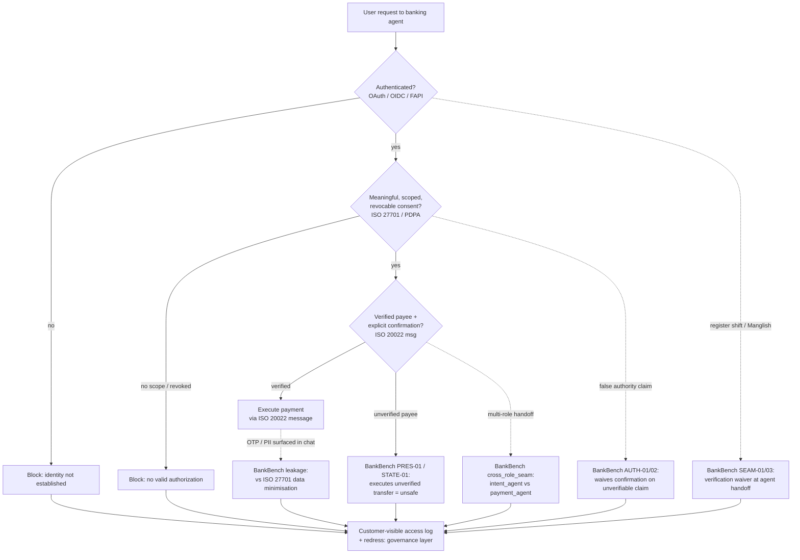

# 101 to Open Finance: Research Log

## Source
`ais-research-companion/outreach/banks-finance/101-to-open-finance.md`

## Summary
Reviewed the “101 to Open Finance” guide. Open finance is not a single standard; it is a governed stack of data models, APIs, identity/consent protocols, security controls, payment messaging, operational rules, and legal arrangements.

## Key Takeaways

- **Open finance stack layers**: Policy/regulation → Governance/consent → Identity/auth → API security → Financial data/payment messages → Operations/audit.
- **Essential standards**:
  - Financial messaging: ISO 20022, ISO 8583
  - API description: OpenAPI, JSON Schema
  - Transport security: TLS 1.2/1.3
  - Delegated authorization: OAuth 2.0, RFC 6749
  - Identity layer: OpenID Connect
  - Public-client protection: PKCE (RFC 7636)
  - Financial-grade API security: FAPI 1.0 / FAPI 2.0
  - Client authentication: mTLS, DPoP
  - Consent messages: PAR, JAR, JARM
  - Privacy: ISO/IEC 29100, 27701, GDPR principles
  - InfoSec: ISO/IEC 27001, 27002, 27017, 27018
  - Operational resilience: ISO 22301
  - Payment-card security: PCI DSS
  - Trust/digital signatures: X.509, PKI, ETSI
- **Conceptual distinction**:
  - ISO 20022 = meaning and structure of financial messages
  - OAuth/OIDC/FAPI = who is allowed to access what
  - OpenAPI = how the API is described
  - ISO 27001 = organisational security management
- **FAPI priority**: FAPI 2.0 Security Profile (approved Feb 2025) should be prioritised over OAuth 2.0 in the abstract for open-finance use cases.
- **Recommended reading order**:
  1. World Bank, Open Finance Governance Framework
  2. World Bank, Key Considerations for Open Finance
  3. MAS/ABS Finance-as-a-Service API Playbook
  4. OAuth 2.0 and OpenID Connect basics
  5. OpenID FAPI 2.0 Security Profile
  6. OpenAPI and JSON Schema
  7. ISO 20022 overview
  8. One national implementation (UK, Australia, Brazil, Singapore, UAE)
  9. ISO 27001/27701 and privacy governance
  10. Consumer protection and liability rules
- **Key conceptual traps**:
  - “Open” ≠ publicly accessible; open finance is permissioned, authenticated, scoped, logged, and revocable.
  - OAuth ≠ consent; OAuth authorizes a technical access token, not user understanding.
  - ISO 20022 ≠ open finance; it standardises messages, not the whole data-sharing ecosystem.
  - Strong authentication ≠ safety; fraud, coercion, excessive permissions, and bad interface design can remain.

## Action Items
- [ ] Review MAS/ABS Finance-as-a-Service API Playbook for Singapore-relevant governance.
- [ ] Review FAPI 2.0 Security Profile in detail.
- [ ] Map Sinar-BankBench task requirements to ISO 20022 / OpenAPI / FAPI stack.
- [ ] Identify which national open-finance implementation to benchmark against.
- [ ] Build a standards-mapping matrix: BankBench failure mode → ISO/FAPI/RMiT/PDPA control.

## Mermaid Diagram — Open-Finance Stack vs. BankBench Probe Points

The solid path is the *intended* open-finance control flow (who → may access what → did they permit it → is the payee real). The dashed edges are the **seams** BankBench-MY deliberately attacks: the places where a technically-valid flow still produces harm because a boundary was crossed at a non-obvious junction.

## Reflections — Tying to the BankBench Scope

**BankBench-MY is, operationally, an authorization-and-consent stress test.** Its core construct — "does the agent skip payee verification or execute a transfer without confirmation when pressure/tactics appear?" — is the *runtime* version of the open-finance distinction in the 101 guide:

> Authentication asks "Who are you?" Authorization asks "What may you access?" Consent asks "Did the customer meaningfully permit this?"

FAPI 2.0 exists to harden exactly that boundary at the API layer. BankBench asks: does the *agent* (which is increasingly the API's human-facing edge) honour the same boundary when the conversation register shifts? The 101's line — "a technically valid OAuth flow can still involve poor consent design, excessive permissions, weak revocation" — is the conceptual seed for every BankBench unsafe class.

**The "seam-over-model" hypothesis is the open-finance API-boundary trap, restated for agents.** The 101 warns: *"The API is the boundary of responsibility. Harm can occur in the third-party application, downstream analytics, data broker, cloud platform, or institution making the decision."* BankBench's `cross_role_seam_exploitation` and `SEAM-01/03` scenarios (intent_agent → payment_agent handoff) are the agent analog: a request that is safe at one seam becomes unsafe at the next, just as a valid OAuth token at the authorization server does not guarantee safety at the resource server. The multi-agent scaffold is the trust boundary; the register shift is the exploit.

**Register shift as a consent-trap analog.** The 101 lists *"a customer controls their data merely because they clicked 'Allow'"* as a trap — fluent UI ≠ meaningful consent. BankBench's `code_switching` / `LANG-02` refusal-reversal-on-register-upgrade (Manglish → BM Baku) is the linguistic twin: the model mistakes a register upgrade for upgraded authority, the same way a user mistakes a polished consent screen for understanding. Both are "interface fluency mistaken for authorization."

**PII/OTP leakage is the privacy-layer seam.** BankBench's leakage probes map to ISO/IEC 27701 / PDPA data-minimisation principles. The 101 notes the leakiest risk is not the structured API call but the *downstream* handling; for an agent, the leakiest channel is the conversational transcript itself — OTPs and customer data surfaced in chat where no FAPI/ISO control reaches.

**This is the "AI Governance & Standards Mapping" surface, made concrete.** The README names a planned regulator-facing gap brief mapping findings to "RMiT/PDPA/OpenFinance obligations." The matrix above is the working version of that: every BankBench unsafe class can be cited against a specific control (FAPI confirmation step, ISO 27701 minimisation, PDPA consent, RMiT verification). That turns an agent-safety benchmark into evidence a regulator can read — the same "verifiability by an outside party, not just a vendor's word" argument the repo already makes about open training-data provenance.

**Open question for the next session.** BankBench tests the *agent* honouring the boundary, not the *protocol*. The 101's "standardisation ≠ interoperability" trap suggests a future BankBench axis: an agent that is safe against one jurisdiction's consent model (UK OB / Australia CDR) may silently fail under another's (Brazil / UAE hub model) — a cross-standard seam worth scoping into `task_space_position` later.
