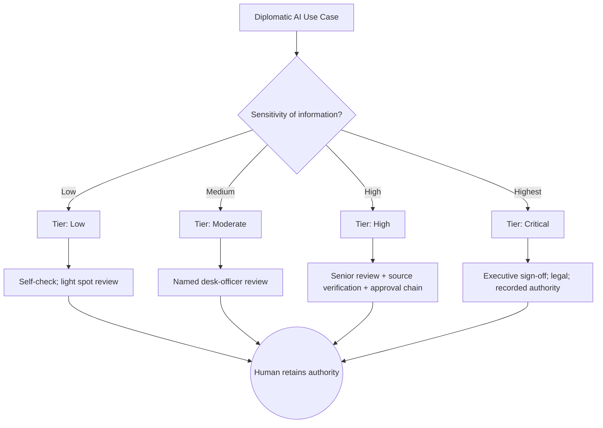
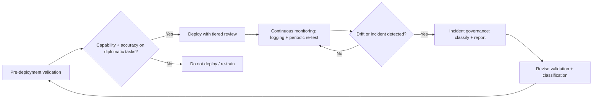
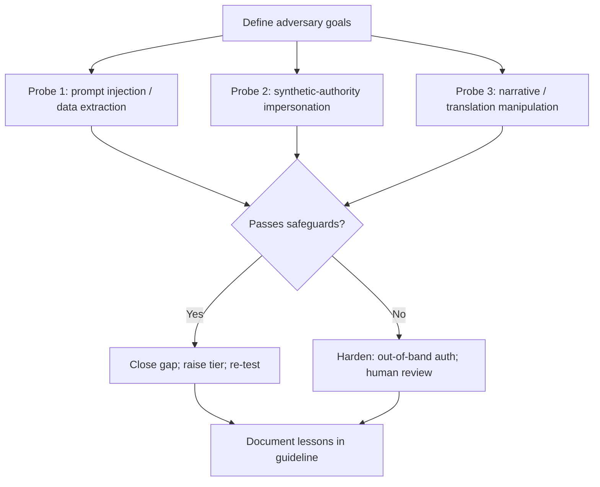
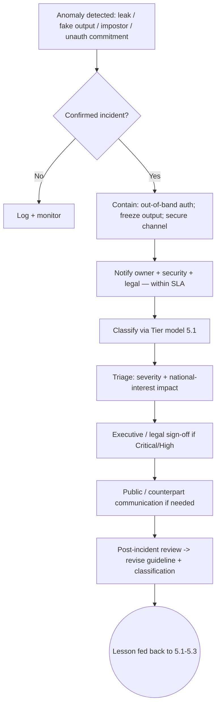
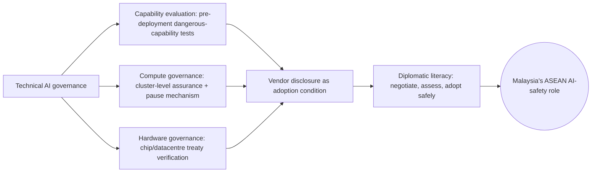

# CHAPTER 5

**AI Safety and Operational Safeguards for Diplomacy**

*From principle to practice: making AI safe in the daily work of statecraft*

*The question for foreign ministries is no longer whether artificial intelligence will be used in diplomatic work, but whether its use will be deliberate, verified and accountable. Safety is not a feature added after deployment; it is the discipline that allows AI to enlarge diplomatic judgement without displacing it.*

# Introduction

Earlier chapters established what artificial intelligence can do for diplomacy, what can go wrong, and where the technology reaches its limits. Chapter 1 framed intelligent statecraft as augmentation rather than replacement, arguing that AI should enlarge the diplomat's field of view while human responsibility for interpretation and representation remains intact. Chapters 2 and 3 then showed, respectively, the risks AI introduces into diplomatic practice and the limitations it cannot reliably overcome. Chapter 4 located these concerns within a framework of ethical dilemmas and accountability. This chapter moves from diagnosis to architecture. It asks the practical question ministries must answer before adoption outpaces governance: what concrete safeguards make AI safe to use in diplomatic work?

The framing is deliberately operational. Risk and limitation, examined earlier, describe where harm may arise; accountability and ethics describe the principles that should govern use. This chapter describes the mechanisms that connect the two: how a foreign ministry assesses and classifies the risk of a given AI use case, how it validates systems before and during deployment, how it tests them against adversarial pressure, and how it establishes the internal rules and escalation paths that keep a human in command. The through-line is Malaysia's emerging role in ASEAN AI safety and the need to distinguish AI safety from the more familiar domains of cybersecurity and information security.

That distinction matters because the three are often conflated. Cybersecurity protects systems and networks from intrusion. Information security protects the confidentiality, integrity and availability of data. AI safety, by contrast, addresses the behaviour of systems that can generate novel outputs, infer unintended patterns, or fail in ways that are not visible at the moment of use. A model may be perfectly secure against attack and yet produce a confident, fluent and wrong diplomatic brief. The International AI Safety Report 2026 stresses that advanced AI can aggravate existing harms and that important failure modes may only become visible in real-world use (International AI Safety Report, 2026), while Shah et al. (2024) draw a parallel analytic distinction between *safety* (preventing unintentional, emergent harm from the system itself) and *security* (preventing deliberate adversary exploitation) that is useful for foreign ministries: both are needed, but they demand different routines. AI safety therefore requires its own vocabulary, its own assessment methods and its own operational routines — the subject of the sections that follow.

# 5.1 AI Risk Assessment and Classification for Diplomatic Use Cases

Effective AI safety begins not with technology but with classification. Not every diplomatic use of AI carries the same consequence, and a proportionate safeguard regime must distinguish a low-stakes internal summary from a negotiation position that affects a bilateral relationship. The NIST AI Risk Management Framework (AI RMF 1.0) treats risk management as a continuous function — Govern, Map, Measure, Manage — in which the first task is to "frame" risk in the specific context of the system's use rather than rely on generic assurances (National Institute of Standards and Technology, 2023). For a foreign ministry, that framing exercise is the foundation of classification.

A useful starting point is to classify use cases along two axes: the sensitivity of the information involved, and the consequentiality of the decision or communication the AI supports. A tool that drafts an internal reading list operates at low sensitivity and low consequence. A system that summarises cabinet papers, proposes negotiating positions, or monitors a counterpart's public statements operates at high sensitivity and potentially high consequence. The classification should travel with the use case and be revisited when the task, the data, or the audience changes.

***Table 5.1  Risk classification matrix for diplomatic AI use cases***

| Tier | Example use case | Information sensitivity | Consequence if wrong | Required review |
| ----- | ----- | ----- | ----- | ----- |
| Low | Internal summarisation of open-source news; meeting-note tidy-up | Low | Minimal | Self-check; light spot review |
| Moderate | Research synthesis for a briefing; first-draft public-facing explainer | Medium | Reputational; minor policy | Named desk officer review |
| High | Negotiation position support; consular advice; risk assessment of a counterpart | High | Bilateral; legal; personal safety | Senior review + source verification + approval chain |
| Critical | Autonomous action on classified material; external commitments in a national position | Highest | National interest; sovereignty | Executive sign-off; legal; recorded authority |

*Source: Authors' synthesis from NIST AI RMF 1.0 (2023) and the project's survey and interview data.*

**Case studies.** *First*, the AI travel-advice incident examined in Chapter 2.1 provides a concrete tiering lesson: Israeli travellers who relied on an AI chatbot indicating that transit through Kuala Lumpur would be safe were detained at KLIA, requiring diplomatic intervention (Malay Mail, 2026). Classified as a consular-advice use case, this falls in the High tier — yet it was treated, by the users, as low-stakes. The gap between perceived and actual tier is precisely what classification discipline is meant to close. *Second*, the survey of 64 diplomatic officers shows where concern concentrates: 46 of 64 (71.9 per cent) spontaneously raised confidentiality, security or data leakage when asked about risk, while 15 (23.4 per cent) pointed to high-stakes decisions, negotiations or crisis work (Survey for Diplomats, 2026). These are exactly the areas a classification scheme should route to the highest tier. *Third*, the distinction drawn in Chapter 4 between assistance and authority is operationalised here: classification is the administrative mechanism that decides, for each task, where assistance ends and authority must be retained.

***Figure 5.1  Risk-classification map for diplomatic AI use cases***

*Source: Authors' synthesis from NIST AI RMF 1.0 (2023) and survey data (Survey for Diplomats, 2026).*

> **Entry-level AI safety action (5.1):** An officer new to AI safety can start today without new software: label every AI-assisted task they perform with its sensitivity tier (Low/Moderate/High/Critical) and write one line on who reviews the output before it leaves the desk. This single habit — *tag the tier, name the reviewer* — is the seed of the full classification scheme.

# 5.2 Evaluation, Validation and Continuous Monitoring

Classification tells a ministry what level of care a use case requires. Evaluation and validation determine whether a system actually deserves that trust in practice. Shevlane et al. (2023) argue that model evaluation is critical for addressing extreme risks because developers must be able to identify dangerous capabilities — through "dangerous capability evaluations" — and the propensity of models to act in harmful ways, while recognising that models can display new capabilities unforeseen by their developers. For diplomacy, the lesson is direct: a tool should not enter sensitive workflows on the strength of a vendor's claim alone.

Pre-deployment validation should answer three questions. First, does the system perform accurately on tasks drawn from real diplomatic work, not only on generic benchmarks? Second, does it handle the multilingual, legally loaded and culturally specific texts that diplomacy produces — the very nuance that Chapter 3 identified as a hard limitation? Third, when it is uncertain, does it signal uncertainty rather than confabulate? Sidhu and Scholefield et al. (2026) extend this logic to the post-deployment phase, noting that AI systems may produce failures after deployment that pre-deployment safety assessments do not anticipate, and that adequate *AI incident governance* requires good definitions, taxonomies, monitoring practices and reporting mechanisms. Their analysis finds existing frameworks inconsistent in how incidents are defined, classified and reported — a gap a ministry can close by building monitoring into its own deployment routine.

**Case studies.** *First*, the Deloitte AI-hallucination case referenced in Chapter 3.3 — a government-commissioned report corrected after non-existent academic references and an invented judicial quotation were identified, with the firm acknowledging the use of generative AI (Tadros & Karp, 2025; Croft, 2025). This is a pre-deployment validation failure: no capability evaluation caught the fabricated citations before release. *Second*, the survey finding that 47 of 64 respondents raised accuracy, hallucination or verification somewhere in their answers shows evaluation is not a theoretical concern but a lived one (Survey for Diplomats, 2026) — officers already practise, in effect, ad-hoc validation. *Third*, the incident-governance gaps documented by Sidhu and Scholefield (2026) — inconsistent taxonomies and reporting across regulatory and independent efforts — illustrate why a ministry's monitoring must define its own incident categories rather than inherit fragmented external ones.

***Figure 5.2  Evaluation-and-monitoring loop for diplomatic AI***

*Source: Authors' synthesis from Shevlane et al. (2023) and Sidhu & Scholefield (2026).*

> **Entry-level AI safety action (5.2):** Before trusting any AI output in diplomatic work, an officer can adopt a one-step rule — *find the source, or don't use the claim*. Verifying a single loaded fact against a primary source turns passive consumption into active evaluation, the core habit Shevlane et al. (2023) describe as dangerous-capability awareness at the user level.

# 5.3 Red-Teaming and Adversarial Testing

Evaluation answers whether a system works as intended under ordinary conditions. Red-teaming asks whether it fails dangerously under pressure. Ganguli et al. (2022) define red teaming as using manual or automated methods to *adversarially probe* a language model for harmful outputs, and treat it as one potentially useful tool among many for addressing harm. In diplomatic contexts, adversarial testing is especially relevant because the threat is not only technical malfunction but deliberate exploitation: a foreign actor may probe a ministry's AI-assisted workflows to extract information, induce a misleading output, or impersonate an official through a system's trusted channels.

Red-teaming for diplomacy should be scenario-based rather than purely technical. A useful exercise asks: how might an adversary use the ministry's own AI tools against it? Can a carefully crafted prompt elicit restricted information that an officer would never place in an email? Can a translation or summarisation step be manipulated to alter the apparent meaning of a position? These are not hypotheticals. Chapter 2.2 already established the impersonation threat in diplomatic terms: an impostor used AI-driven technology to pose as Secretary of State Marco Rubio and contact foreign ministers and other officials by text, Signal and voicemail (Lee, 2025). That case is, in effect, an external red-team result delivered by a malicious actor — the safeguard version runs the same probe inside the ministry before harm occurs.

**Case studies.** *First*, the Rubio impersonation above motivates red-teaming of identity and authentication channels specifically: a red-team exercise should simulate a synthetic-authority approach and test whether the workflow's verification steps hold. *Second*, Ganguli et al. (2022) document scaling behaviours in red-teaming — that models' resistance to probing changes in non-linear ways as capability grows — which implies a ministry's red-team cadence must track model updates rather than be a one-off gate. *Third*, the "battle of narratives" dynamic described by Dato' Mohd Suhaimi Jaafar in Chapter 2 (interview) shows why adversarial testing must include narrative manipulation: a model that generates persuasive but false diplomatic content is a red-team target in its own right, not merely a factual-accuracy problem.

***Figure 5.3  Red-teaming adversarial probe flow for diplomatic AI***

*Source: Authors' synthesis from Ganguli et al. (2022) and the Rubio impersonation case (Lee, 2025).*

> **Entry-level AI safety action (5.3):** Treat any unusual instruction or flattering message arriving through a new channel as guilty until verified. A junior officer's daily habit of *call-back on a known number* for anything sensitive is, in miniature, the red-teaming lesson Ganguli et al. (2022) describe — assume the plausible is potentially adversarial, and authenticate out-of-band.

# 5.4 Internal AI Guidelines, Escalation Protocols and Safe-Use Policies

Classification, evaluation and red-teaming are necessary but insufficient unless embodied in clear internal rules and a working escalation path. The NIST AI RMF's *Govern* function stresses accountable, transparent and explainable use as organisational prerequisites (National Institute of Standards and Technology, 2023); OWASP's Gen AI Security Project (Top 10 for LLM Applications) translates this into concrete adversarial categories — prompt injection, supply-chain, excessive agency, and data leakage among them — that a foreign-ministry safe-use policy should explicitly prohibit or constrain. The survey data point to a readiness gap these guidelines must close: only 15 of 64 respondents agreed that procedures for using AI were clear and systematic, while 31 disagreed (Survey for Diplomats, 2026). Enthusiasm for AI is clearly ahead of the operational support that would make its use safe.

Internal guidelines should translate principles into procedure. At minimum they should state: what may be entered into an AI system; what must remain within approved, secure platforms; which use cases require named human review; who approves specialised tools at overseas missions; and what officers should do when a system produces something they cannot verify. The MOSTI National Guidelines on AI Governance and Ethics provide a national anchor through principles such as privacy, security, transparency and accountability, but those principles require translation into foreign-affairs operating rules (Ministry of Science, Technology and Innovation Malaysia, 2024). A guideline that merely restates "be careful" changes nothing; a guideline that names the approver, the channel and the consequence does.

Escalation protocols address the moment something goes wrong — a suspected leak through a prompt, a fabricated source that reached a superior, a deepfake impostor contacting the mission, or a model producing an unauthorised commitment. The protocol should specify who is notified, through what secure channel, on what timeline, and what immediate containment steps apply. Sidhu and Scholefield (2026) show why this matters: without consistent incident definitions and reporting mechanisms, organisations cannot analyse failures deeply or representatively. A pre-agreed protocol converts panic into procedure and feeds lessons back into classification and monitoring.

Figure 5.4 maps the escalation protocol as a decision flow.

***Figure 5.4  Escalation-protocol flowchart for AI incidents in diplomatic work***

*Source: Authors' synthesis from Sidhu & Scholefield (2026), NIST AI RMF 1.0 (2023), and survey readiness gaps (Survey for Diplomats, 2026).*

> **Entry-level AI safety action (5.4):** Keep a one-page personal rule sheet: *what I may paste into AI, what I never paste, and who I call if something looks wrong.* Distributing this to every officer — not just the AI champions — is the cheapest possible safe-use policy and the foundation the full guideline in this section builds on.

The interviews reinforce that guidance is only as strong as the training that carries it. Ambassador Zamshari Shaharan argued that awareness cannot be built by announcing that AI exists; officers need to understand hallucination, prompting, source limits and the boundary between personal and official use. His conclusion was direct: "I think, tak ada jalan lain but training. You need to do training."¹ Training and guideline are two faces of the same requirement — the institution must make safe use the path of least resistance, not an afterthought.

**Case studies.** *First*, the KLIA travel-advice incident (5.1) reappears here as an escalation case: had a clear protocol existed for challenging AI-generated consular advice, diplomatic intervention might have been prevented. *Second*, the Rubio impersonation (5.3) is an escalation trigger in practice — it shows the protocol must cover *inbound* synthetic authority, not only outbound leaks. *Third*, the survey's readiness gap (only 13 of 64 had access to expert guidance) is itself the case for writing the safe-use policy now rather than after a incident.

# 5.5 Technical AI Governance for Foreign Affairs

The preceding sections treated AI safety as a set of routines a ministry can run with general-purpose tools. A final layer concerns the *technical* governance of the systems themselves — the controls built into models, compute and supply chains that determine what a system can do before a diplomat ever touches it. This is where diplomacy meets the frontier of AI governance, and where Malaysia's emerging ASEAN role can be most distinctive.

Three technical governance levers are increasingly relevant to foreign affairs. The first is **evaluation of dangerous capabilities**, the practice Shevlane et al. (2023) and Shah et al. (2024) describe as identifying, before deployment, whether a model can enable harmful acts such as manipulation or cyber offence. The second is **compute governance** — the idea, advanced by Ramiah et al. (2025) in a proposal for a global "compute governance" regime with a pause mechanism, that the large clusters training frontier models are a tractable control point for international assurance. The third is **hardware-level governance**, where Ansari (2026) offers a feasibility taxonomy for verifying compliance and even treaty obligations at the chip and datacentre level. The UK AISI's *Emerging Processes for Frontier AI Safety* (2023) and the *Emerging Practices in Frontier AI Safety Frameworks* review (Frontier Safeguards, 2025) show these ideas moving from theory into state practice, while the International AI Safety Report 2026 situates them in a multilateral agenda that Malaysia can engage through ASEAN.

For a foreign ministry, technical governance is not about building the eval harness — it is about knowing what questions to ask of vendors and partners. A diplomat negotiating a digital-partnership agreement, a cyber attaché assessing a counterpart's AI capacity, or a mission evaluating whether to adopt a foreign-hosted system all benefit from a working literacy in these levers. The governance need is therefore twofold: externally, Malaysia should be able to represent its interests in emerging compute and safety frameworks; internally, it should require vendors to disclose capability-evaluation and incident-history information as a condition of adoption.

**Case studies.** *First*, the Rubio impersonation (5.3) is also a technical-governance failure at the platform level — a synthetic identity was sustained across text, Signal and voicemail, showing that identity assurance is now a model-and-channel property, not only a human one (Lee, 2025). *Second*, the International AI Safety Report 2026 demonstrates the multilateral track: states are building shared vocabularies for frontier risk that Malaysia can shape rather than inherit. *Third*, Ramiah et al.'s (2025) compute-governance proposal illustrates a concrete diplomatic artefact — a verifiable "pause button" — that a middle-power can champion as a confidence-building measure in ASEAN forums.

***Figure 5.5  Technical AI governance levers for foreign affairs***

*Source: Authors' synthesis from Shah et al. (2024), Shevlane et al. (2023), Ramiah et al. (2025), Ansari (2026), UK AISI (2023), Frontier Safeguards (2025), International AI Safety Report (2026).*

> **Entry-level AI safety action (5.5):** When evaluating any AI tool for mission use, an officer can ask the vendor three questions — *what dangerous-capability testing did you run, where is my data stored, and what is your incident-reporting history?* Even without technical depth, demanding these answers shifts the burden of proof to the supplier and is the user-facing edge of technical governance.

# Conclusion

AI safety in diplomacy is not a separate subject from the craft itself; it is the craft adapted to a new instrument. This chapter has treated safety as a set of operational routines rather than an aspiration. Classification gives each use case its due level of care, building on Chapter 1's augmentation premise by deciding where human review is mandatory. Evaluation and monitoring establish whether a system earns trust and keep watch after deployment, answering the verification problem that Chapter 3 identified as the technology's central limitation. Red-teaming probes how systems fail under pressure, hardening against the impersonation and manipulation risks of Chapter 2. Guidelines and escalation protocols ensure that human authority is never ambiguous and that failure, when it occurs, is contained rather than compounded — the operational expression of Chapter 4's accountability principles. Technical governance, set out in section 5.5, extends this discipline upstream to the models, compute and supply chains themselves, so that a ministry can ask the right questions of vendors and partners rather than accept capability on trust.

The distinction drawn at the opening — between AI safety, cybersecurity and information security — runs through all five sections. Securing a network does not make a model truthful; protecting data does not make a summary faithful; evaluating a system for adversary resistance is necessary but insufficient if its own emergent behaviour is unexamined. AI safety addresses the behaviour of systems that generate, infer and decide, often without a human seeing the moment of error. For Malaysia, building these routines is also a regional opportunity: a foreign ministry that can demonstrate disciplined, documented safeguard practice — and speak credibly about capability evaluation, compute governance and hardware assurance — is better placed to contribute to ASEAN AI safety norms than one that merely adopts tools.

The larger point returns to the book's central argument. AI can widen the diplomat's field of view, compress the time required for preparation, and surface risks that would otherwise be missed. It cannot carry the responsibility of representation, nor can it know when an efficient phrase undermines a carefully balanced position. The safeguards described here — from the entry-level habits any officer can adopt today to the technical-governance literacy the service should build — exist so that technology gives diplomats more time and analytical space to do what the profession has always required: understand, persuade, negotiate and exercise judgement on behalf of the state.

# Endnotes

1\. Interview with Ambassador Zamshari Shaharan, clean verbatim transcription, conducted by Dr Murni Wan Mohd Nor, 2026. Quotation preserved verbatim, including code-switching.

# References

Ganguli, D., Lovitt, L., Kernion, J., Askell, A., Bai, Y., Kadavath, S., … (2022). *Red Teaming Language Models to Reduce Harms: Methods, Scaling Behaviors, and Lessons Learned*. arXiv:2209.07858. https://arxiv.org/abs/2209.07858

International AI Safety Report. (2026). *International AI Safety Report 2026*. https://internationalaisafetyreport.org/sites/default/files/2026-02/international-ai-safety-report-2026.pdf

Lee, M. (2025, July 9). Impostor uses AI to impersonate Rubio and contact foreign and US officials. *Associated Press*.

Malay Mail. (2026, March 30). AI travel advice backfires: Israelis detained at KLIA during transit, envoy warns against Malaysia trips.

Ministry of Science, Technology and Innovation Malaysia. (2024). *The National Guidelines on AI Governance & Ethics (AIGE)*.

National Institute of Standards and Technology. (2023). *Artificial Intelligence Risk Management Framework (AI RMF 1.0)*. NIST. https://doi.org/10.6028/NIST.AI.100-1

OWASP. (2024). *OWASP Gen AI Security Project — Top 10 for LLM Applications*. https://genai.owasp.org/

Ramiah, A. A., Koopmanschap, R., Thorsteinson, J., & Khan, S. (2025). *Toward a Global Regime for Compute Governance: Building the Pause Button*. arXiv:2506.20530. https://arxiv.org/abs/2506.20530

Shah, R., Irpan, A., Turner, A. M., Wang, A., … (2024). *An Approach to Technical AGI Safety and Security*. arXiv:2504.01849. https://arxiv.org/abs/2504.01849

Shevlane, T., Farquhar, S., Garfinkel, B., Phuong, M., Whittlestone, J., Leung, J., … (2023). *Model Evaluation for Extreme Risks*. arXiv:2305.15324. https://arxiv.org/abs/2305.15324

Sidhu, H. K., Scholefield, R., Annan, N., Hernandez, K., Hou, I. N., Alshaikhi, A., Chin, Z. S., & Gipiškis, R. (2026). *Open Problems in AI Incident Governance*. arXiv:2607.05163. https://arxiv.org/abs/2607.05163

Survey for Diplomats: Innovating Diplomacy (Responses). (2026). Unpublished survey dataset [64 responses]. Institute of Diplomacy and Foreign Relations.

Tadros, E., & Karp, P. (2025, October 5). Deloitte to refund government, admits using AI in $440k report. *Australian Financial Review*.

Croft, D. (2025, October 9). Deloitte to refund government after using AI in $440k report. *Accounting Times*.

UK AISI. (2023). *Emerging Processes for Frontier AI Safety*. https://assets.publishing.service.gov.uk/media/653aabbd80884d000df71bdc/emerging-processes-frontier-ai-safety.pdf

Ansari, S. (2026). *Hardware-Level Governance of AI Compute: A Feasibility Taxonomy for Regulatory Compliance and Treaty Verification*. arXiv:2604.04712. https://arxiv.org/abs/2604.04712

Frontier Safeguards. (2025). *Emerging Practices in Frontier AI Safety Frameworks*. https://cdn.prod.website-files.com/663bd486c5e4c81588db7a1d/67aa1ef13654dc168a71e83a_EmergingPracticesInFrontierAISafetyFrameworksA.pdf

*Source note: This v1 draft draws on the defined corpus Chapter 5 folder (Shevlane 2023; Ganguli 2022; NIST AI RMF 1.0; Sidhu & Scholefield 2026; OWASP Gen AI Top 10) and the project's survey and interview data. The KLIA, Rubio, and Deloitte cases are reused from Ch.2/Ch.3 as operational illustrations, per the interlinking requirement.*

---

**Proposed Additional Sources:** *(none — all material drawn from the defined corpus and project data; the four Chapter 5 PDFs are now part of `gdrive_pdf_index.md`)*
