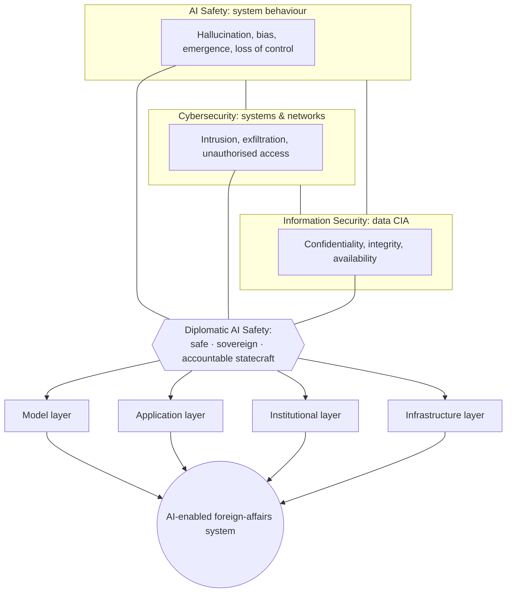
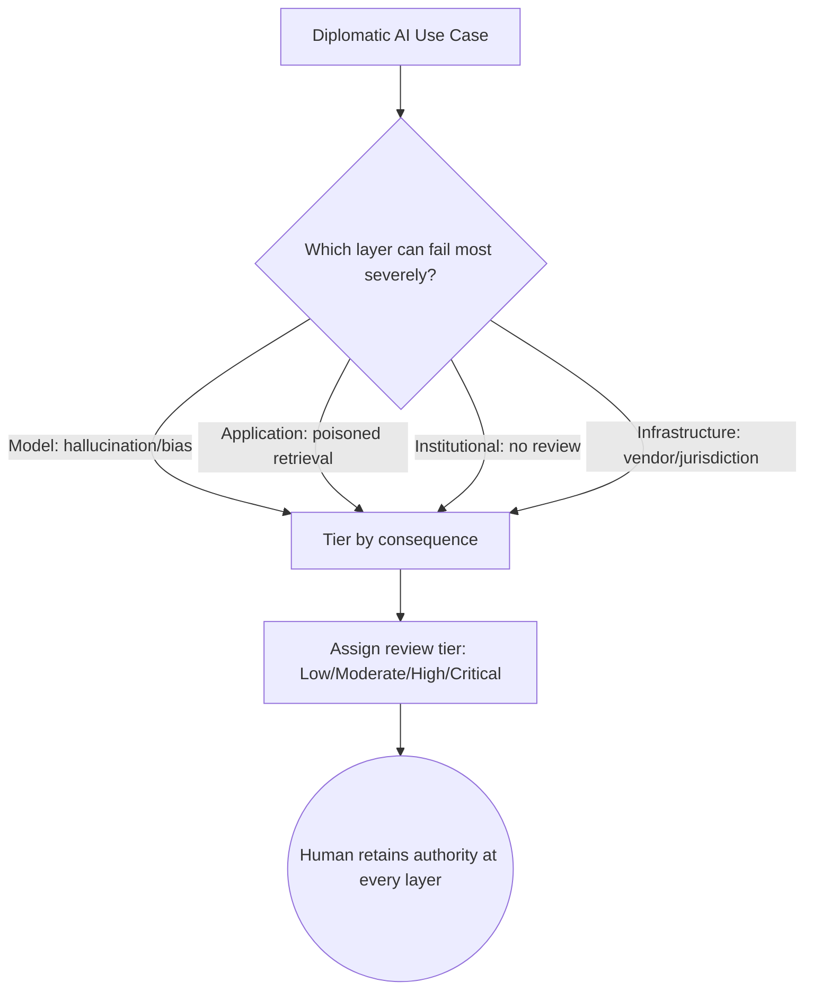
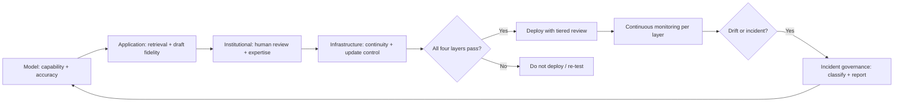
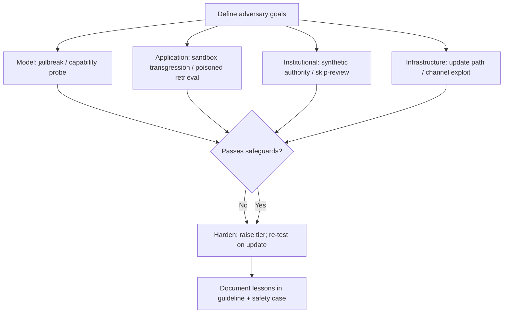
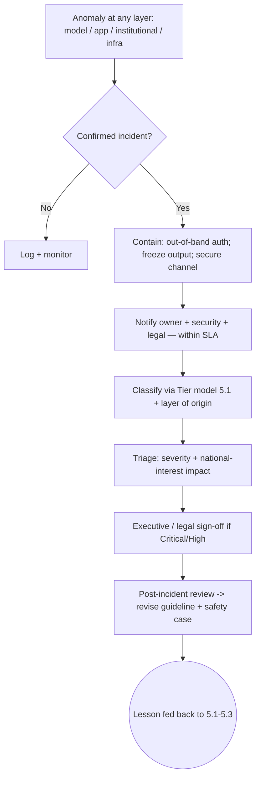
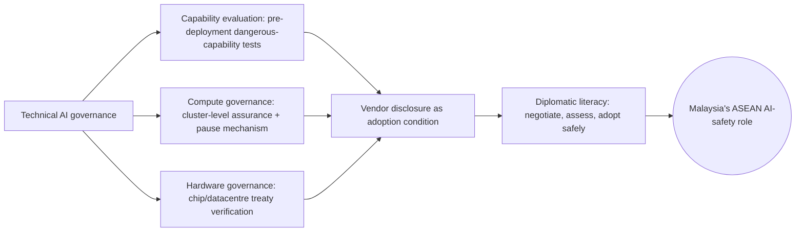
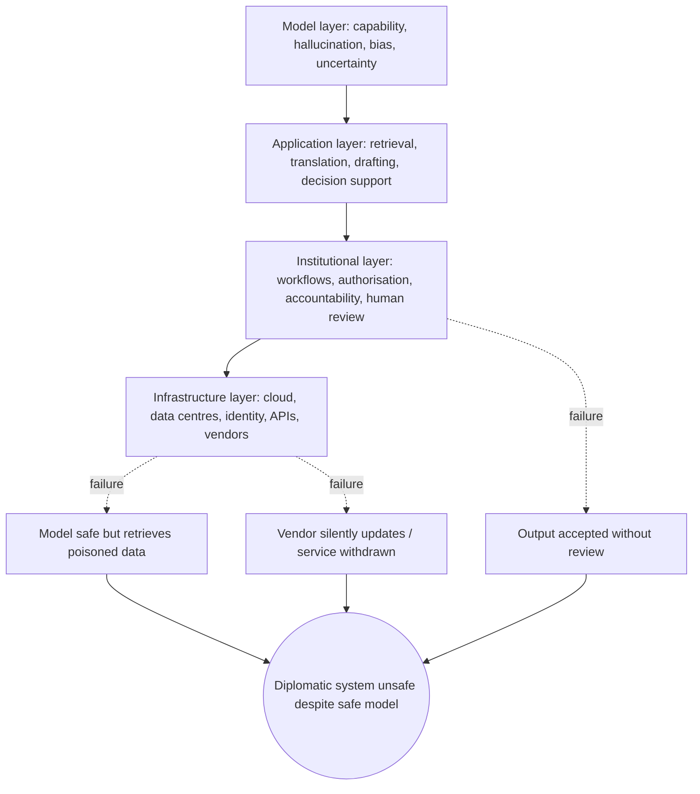

# CHAPTER 5

**AI Safety and Operational Safeguards for Diplomacy**

*From principle to practice: making AI safe in the daily work of statecraft*

*The question for foreign ministries is no longer whether artificial intelligence will be used in diplomatic work, but whether its use will be deliberate, verified and accountable. Safety is not a feature added after deployment; it is the discipline that allows AI to enlarge diplomatic judgement without displacing it.*

# Introduction

Earlier chapters established what artificial intelligence can do for diplomacy, what can go wrong, and where the technology reaches its limits. Chapter 1 framed intelligent statecraft as augmentation rather than replacement, arguing that AI should enlarge the diplomat's field of view while human responsibility for interpretation and representation remains intact.

Chapters 2 and 3 then showed, respectively, the risks AI introduces into diplomatic practice and the limitations it cannot reliably overcome. Chapter 4 located these concerns within a framework of ethical dilemmas and accountability. This chapter moves from diagnosis to architecture. It asks the practical question ministries must answer before adoption outpaces governance: what concrete safeguards make AI safe to use in diplomatic work?

The framing is deliberately operational. Risk and limitation, examined earlier, describe where harm may arise; accountability and ethics describe the principles that should govern use.

This chapter describes the mechanisms that connect the two: how a foreign ministry assesses and classifies the risk of a given AI use case, how it validates systems before and during deployment, how it tests them against adversarial pressure, and how it establishes the internal rules and escalation paths that keep a human in command. The through-line is Malaysia's emerging role in ASEAN AI safety and the need to distinguish AI safety from the more familiar domains of cybersecurity and information security.

That distinction matters because the three are often conflated. Cybersecurity protects systems and networks from intrusion. Information security protects the confidentiality, integrity and availability of data.

AI safety, by contrast, addresses the behaviour of systems that can generate novel outputs, infer unintended patterns, or fail in ways that are not visible at the moment of use. A model may be perfectly secure against attack and yet produce a confident, fluent and wrong diplomatic brief.

The International AI Safety Report 2026 stresses that advanced AI can aggravate existing harms and that important failure modes may only become visible in real-world use (International AI Safety Report, 2026). Shah et al. (2024) draw a parallel analytic distinction between *safety* (preventing unintentional, emergent harm from the system itself) and *security* (preventing deliberate adversary exploitation) that is useful for foreign ministries: both are needed, but they demand different routines.

AI safety therefore requires its own vocabulary, its own assessment methods and its own operational routines — the subject of the sections that follow.

Figure I.1 sets out the chapter's point of view. Diplomatic AI safety sits at the intersection of three protective disciplines — AI safety, cybersecurity and information security — but its object is the *AI-enabled foreign-affairs system* as a whole, judged by whether it preserves safe, sovereign and accountable statecraft.

***Figure I.1  The chapter's POV — AI safety for diplomatic statecraft***

*Source: Authors' synthesis from Shah et al. (2024), International AI Safety Report (2026), and the four-layer system model (perplexity refinement).*

# 5.1 AI Risk Assessment and Classification for Diplomatic Use Cases

Effective AI safety begins not with technology but with classification. The NIST AI Risk Management Framework (AI RMF 1.0) treats risk management as a continuous function — Govern, Map, Measure, Manage — whose first task is to "frame" risk in the specific context of the system's use rather than rely on generic assurances (National Institute of Standards and Technology, 2023). For a foreign ministry, that framing is the foundation of classification: it decides, before any tool is adopted, what level of care a use case demands.

A useful way to make classification concrete is to read every use case through the **four-layer system** introduced in this chapter's opening (Figure I.1): risk does not live in one place, it accumulates across layers, and a classification that ignores a layer is incomplete.

***Table — The four-layer AI-enabled foreign-affairs system (classification lens)***

| Layer | What can go wrong here | Diplomatic example |
| -- | -- | -- |
| Model | Hallucination, bias, miscalibration in the model's own outputs. | A translation model confidently mistranslates a legal term. |
| Application | How the model is wired into work — retrieval, drafting, summarisation. | A retrieval step pulls a poisoned embassy cable the model alone would never reveal. |
| Institutional | Who approves, reviews and is accountable. | A consular brief accepted without named review. |
| Infrastructure | Where data and compute sit, under whose jurisdiction. | A vendor with silent update rights changes behaviour after approval. |

Classification tags each use case by the *highest* layer at which a serious failure could occur, then assigns review accordingly. The nine-category **diplomatic risk taxonomy** supplies the vocabulary for *what* harm a layer might cause; the tier model (Table 5.1) supplies the *how much care*. The nine categories are set out below so the reader can see the full range — from everyday error to the catastrophic end of the scale.

***Table — The nine-category diplomatic risk taxonomy***

| # | Category | What can go wrong (diplomatic example) |
| -- | -- | -- |
| 1 | Epistemic | Confident but false facts, hallucination, poor uncertainty calibration — a fluent briefing that quietly gets a figure wrong. |
| 2 | Linguistic-cultural | Lost nuance, mistranslation, or culturally tone-deaf phrasing that offends or misleads a counterpart. |
| 3 | Information-integrity | Fabricated sources, deepfakes, or manipulated evidence entering the diplomatic record. |
| 4 | Cybersecurity | Intrusion, exfiltration, prompt injection, or poisoned retrieval from a connected system. |
| 5 | Decision | AI distorting or crowding out human judgement in a high-stakes call. |
| 6 | Institutional | Unclear ownership, missing review, or accountability gaps when something breaks. |
| 7 | Sovereignty | Data or jurisdiction held offshore, vendor control of updates, dependency on foreign compute. |
| 8 | Systemic | Contagion across missions and partners; gradual erosion of trust in the institution. |
| 9 | Catastrophic | A single failure cascading to bilateral rupture, conflict escalation, or loss of life. |

The ninth category — **catastrophic** — is why classification can never be cosmetic. The International AI Safety Report 2026 treats catastrophic AI risk, including escalation and loss of control, as a live policy concern rather than a distant scenario.

Classification exists to keep the most dangerous uses at the Critical tier, where executive sign-off applies before any output reaches the world. Incidents in diplomacy are not always minor, and the rest of this chapter returns to that point.

***Table 5.1  Risk classification matrix for diplomatic AI use cases***

| Tier | Example use case | Information sensitivity | Consequence if wrong | Required review |
| ----- | ----- | ----- | ----- | ----- |
| Low | Internal summarisation of open-source news; meeting-note tidy-up | Low | Minimal | Self-check; light spot review |
| Moderate | Research synthesis for a briefing; first-draft public-facing explainer | Medium | Reputational; minor policy | Named desk officer review |
| High | Negotiation position support; consular advice; risk assessment of a counterpart | High | Bilateral; legal; personal safety | Senior review + source verification + approval chain |
| Critical | Autonomous action on classified material; external commitments in a national position | Highest | National interest; sovereignty | Executive sign-off; legal; recorded authority |

*Source: Authors' synthesis from NIST AI RMF 1.0 (2023) and our survey and interview data.*

### Case studies — 5.1 AI Risk Assessment & Classification for Diplomatic Use Cases

*First*, our survey shows officers already reason in layers without naming them: 46 of 64 respondents (71.9 per cent) spontaneously raised confidentiality or data-leakage concerns — an instinctive infrastructure-layer worry — while 15 (23.4 per cent) pointed to high-stakes decisions and negotiations, an institutional-layer worry (Survey for Diplomats, 2026). We classify precisely to make that instinct auditable. *Second*, the International AI Safety Report 2026 argues that advanced AI can aggravate existing harms and that failure modes surface only in real-world use (International AI Safety Report, 2026) — exactly why a static, model-only classification is unsafe and the four-layer view is needed. *Third*, the distinction we drew in Chapter 4 between assistance and authority is operationalised here: classification is the administrative mechanism that decides, for each task and each layer, where assistance ends and authority must be retained.

***Figure 5.1  Risk-classification map for diplomatic AI use cases***

*Source: Authors' synthesis from NIST AI RMF 1.0 (2023), the four-layer model, and the nine-category diplomatic risk taxonomy.*

> **Entry-level AI safety action (5.1) — model & institutional layers:** An officer new to AI safety can start today without new software: label every AI-assisted task with the layer most likely to fail (model / app / institutional / infrastructure) and the tier (Low–Critical), plus one line naming the reviewer. This single habit — *tag the layer, tag the tier, name the reviewer* — is the seed of the full classification scheme.

# 5.2 Evaluation, Validation and Continuous Monitoring

Classification (5.1) tells a ministry what level of care a use case requires. Evaluation and validation determine whether a system actually deserves that trust — and, as the four-layer model insists, the answer differs at every layer. Shevlane et al. (2023) argue that model evaluation is critical for addressing extreme risks because developers must identify dangerous capabilities through "dangerous capability evaluations" and the propensity of models to act harmfully, while recognising that models can display new capabilities unforeseen by their developers.

For diplomacy, the lesson is direct: a tool should not enter sensitive workflows on the strength of a vendor's claim alone. Evaluation must be run at each layer.

***Table 5.2a — What to evaluate at each layer***

| Layer | What to evaluate / test |
| -- | -- |
| Model | Capability and accuracy on real diplomatic tasks (not generic benchmarks); probe for hallucination, bias, poor calibration — Shevlane's dangerous-capability evaluation belongs here. |
| Application | The system as wired: retrieval quality, translation fidelity, draft coherence on the ministry's own documents. A model that passes in chat can fail the moment it touches a cable database or email. |
| Institutional | Whether officers notice errors, challenge recommendations, and retain the expertise to operate without the tool — the human-factor evaluation Ganguli et al. (2022) and the International AI Safety Report 2026 treat as essential. |
| Infrastructure | Continuity: does the workflow survive a vendor outage, a silent model update, or a jurisdiction change? Monitoring here is often the only warning the system has drifted. |

Sidhu and Scholefield et al. (2026) extend this to the post-deployment phase: AI systems may produce failures that pre-deployment assessments do not anticipate, and adequate *AI incident governance* requires good definitions, taxonomies, monitoring practices and reporting mechanisms. Their analysis finds existing frameworks inconsistent in how incidents are defined and classified — a gap a ministry closes by monitoring at all four layers rather than trusting a one-time model certificate.

The NIST *Generative AI Profile*, companion to the AI RMF 1.0, supports this by treating evaluation, red-teaming, incident response and lifecycle monitoring as parts of organisational risk management (National Institute of Standards and Technology, 2023). The same open-source tooling used for red-teaming (5.3) can run a ministry's first model-layer evaluation at low cost, so capability testing is not reserved for vendors.

### Case studies — 5.2 Evaluation, Validation and Continuous Monitoring

*First*, Shevlane et al. (2023) show that dangerous capabilities can emerge without developer intent — a model may gain a capacity no benchmark tested for — which is precisely why model-layer evaluation must be assumption-breaking, not checklist-based, in diplomatic adoption. *Second*, our survey's human-factor signal: 47 of 64 respondents raised accuracy, hallucination or verification somewhere in their answers (Survey for Diplomats, 2026), evidence that officers already practise ad-hoc validation at the institutional layer and should be given a formal one. *Third*, Sidhu and Scholefield's (2026) finding that incident taxonomies are inconsistent across regulators means our monitoring definitions (layer by layer) are not a bureaucratic extra but the only reliable incident record.

***Figure 5.2  Evaluation-and-monitoring loop across the four layers***

*Source: Authors' synthesis from Shevlane et al. (2023), Sidhu & Scholefield (2026), Ganguli et al. (2022), NIST Generative AI Profile (2023).*

> **Entry-level AI safety action (5.2) — model & application layers:** Before trusting any AI output, an officer can adopt a one-step rule — *find the source, or don't use the claim*. Verifying a single loaded fact against a primary source turns passive consumption into active, model-layer evaluation and is the habit Shevlane et al. (2023) describe as dangerous-capability awareness at the user level.

# 5.3 Red-Teaming and Adversarial Testing

Evaluation (5.2) answers whether a system works as intended under ordinary conditions. Red-teaming asks whether it fails dangerously under pressure — and, read through the four layers, failure at each layer looks different. Ganguli et al. (2022) define red teaming as using manual or automated methods to *adversarially probe* a language model for harmful outputs, treating it as one tool among many for addressing harm. In diplomacy the threat is not only technical malfunction but deliberate exploitation across the stack.

***Table 5.3a — What to red-team at each layer***

| Layer | What to probe / adversarially test |
| -- | -- |
| Model | Jailbreaks, biased or manipulable outputs, and emergent harmful capabilities the vendor did not test. |
| Application | **Sandbox transgression** — a bounded assistant (translator, summariser, drafter) whose access to tools, documents and workflows lets it act outside its approved assumptions. Test a poisoned briefing document, an indirect prompt injection in an external report, or a translation that subtly shifts a negotiation position. |
| Institutional | The human and procedural perimeter — can a synthetic authority induce an officer to skip review, or an agent send an unauthorised communication? |
| Infrastructure | Channel and continuity — can an adversary exploit a vendor's update path, or remove analytic capacity during a regional crisis? |

Ganguli et al. (2022) document **scaling behaviours** in red-teaming: a model's resistance to probing changes non-linearly as capability grows. That implies a ministry's red-team cadence must track model updates rather than be a one-off gate — a direct infrastructure-layer concern, since vendors update silently.

Civic-tech practice shows this discipline need not be expensive. Open-source red-teaming toolkits — such as Garak and Microsoft's PyRIT — let a small team probe a model for jailbreaks and prompt injection at near-zero cost, and running an open-weight model locally (for example via Ollama) keeps diplomatic data on ministry hardware, turning a sovereignty worry (infrastructure layer) into the easiest first step. We recommend ministries begin with these free, well-documented tools before procuring bespoke platforms.

### Case studies — 5.3 Red-Teaming and Adversarial Testing

*First*, Ganguli et al.'s (2022) scaling result means a system judged safe at version N may be unsafe at N+1; red-teaming must be version-pinned and re-run on every update — the institutional and infrastructure layers, not the model alone, enforce this. *Second*, the sandbox-transgression scenarios above (poisoned document, injected report, shifted translation) are application-layer failures no model benchmark would surface; they must be red-teamed as deployed systems, not as chat prompts. *Third*, the International AI Safety Report 2026 frames adversarial testing as part of a broader evaluation culture across states — a norm Malaysia can import into ASEAN exercises rather than treat as a vendor service (International AI Safety Report, 2026).

***Figure 5.3  Red-teaming adversarial probe across the four layers***

*Source: Authors' synthesis from Ganguli et al. (2022), the sandbox-transgression concept, and International AI Safety Report (2026).*

> **Entry-level AI safety action (5.3) — institutional & infrastructure layers:** Treat any unusual instruction or flattering message arriving through a new channel as guilty until verified. A junior officer's daily habit of *call-back on a known number* for anything sensitive is, in miniature, the red-teaming lesson Ganguli et al. (2022) describe — assume the plausible is potentially adversarial, and authenticate out-of-band.

# 5.4 Internal AI Guidelines, Escalation Protocols and Safe-Use Policies

Classification (5.1), evaluation (5.2) and red-teaming (5.3) are necessary but insufficient unless embodied in clear internal rules and a working escalation path. Read through the four layers, the guideline must specify something at each:

***Table 5.4a — What the guideline must specify at each layer***

| Layer | What the guideline must specify |
| -- | -- |
| Model | Which models are approved for which tiers; prohibition of unvetted models on sensitive work; any deployed model must carry a current evaluation record. |
| Application | What may be entered into a system, what must stay on approved platforms, and constraints on retrieval/tool access — the OWASP Gen AI Top 10 categories (prompt injection, supply-chain, excessive agency, data leakage) map here (OWASP, 2024). |
| Institutional | Named human review per tier, who approves tools at missions, and the escalation protocol — who is notified, through what secure channel, on what timeline, with what containment. The NIST AI RMF *Govern* function makes accountable, transparent use an organisational prerequisite (National Institute of Standards and Technology, 2023). |
| Infrastructure | Data-residency and jurisdiction rules, vendor-update notification, continuity and exit clauses — the sovereignty dimension the guideline must not omit. |

Our survey points to a readiness gap these guidelines must close: only 15 of 64 respondents agreed procedures for using AI were clear and systematic, while 31 disagreed (Survey for Diplomats, 2026). The MOSTI National Guidelines on AI Governance and Ethics supply national principles — privacy, security, transparency, accountability — but those require translation into foreign-affairs operating rules (Ministry of Science, Technology and Innovation Malaysia, 2024).

A guideline that merely restates "be careful" changes nothing; one that names the approver, the channel and the consequence does. Civic-tech commons help here too: the OWASP Gen AI Top 10 already maps the application-layer pitfalls (prompt injection, supply-chain, excessive agency, data leakage) as free, maintained guidance a ministry can adopt directly, and open-source policy templates lower the cost of writing the guideline itself.

The guideline and protocol are most effective when anchored to a **diplomatic AI safety case**: a structured, evidence-backed argument that a deployment is acceptably safe for a defined use. For each significant use case the ministry documents intended purpose, prohibited uses, users and affected parties, data classification, model and vendor, tools and permissions, known limitations, evaluation results, red-team results, human decision points, incident-response procedures, fallback arrangements, and conditions for suspension.

This converts "responsible AI" into something approvable and auditable, and is where the taxonomy (5.1) and system-level evaluation (5.2) land as formal evidence.

***Figure 5.4  Escalation-protocol flowchart for AI incidents in diplomatic work***

*Source: Authors' synthesis from Sidhu & Scholefield (2026), NIST AI RMF 1.0 (2023), OWASP Gen AI Top 10 (2024), and our survey readiness gaps (Survey for Diplomats, 2026).*

### Case studies — 5.4 Internal AI Guidelines, Escalation Protocols and Safe-Use Policies

*First*, our survey's readiness gap (only 15 of 64 found procedures clear) is itself the mandate: guidelines written along the four layers close exactly the ambiguity officers report (Survey for Diplomats, 2026). *Second*, Sidhu and Scholefield (2026) show incident definitions are inconsistent across regulators — our safety-case template (above) is the only reliable internal record and the seed of the regional incident database later chapters propose. *Third*, the MOSTI guidelines demonstrate the national anchor exists; the foreign-affairs translation gap is the real work, and Chapter 6 takes up vendor and sovereignty clauses in detail.

> **Entry-level AI safety action (5.4) — institutional layer:** Keep a one-page personal rule sheet: *what I may paste into AI, what I never paste, and who I call if something looks wrong.* Distributing this to every officer — not just the AI champions — is the cheapest possible safe-use policy and the foundation the full guideline builds on.

Our interviews reinforce that guidance is only as strong as the training that carries it. Ambassador Zamshari Shaharan was direct: awareness cannot be built by announcing that AI exists; officers need to understand hallucination, prompting, source limits and the boundary between personal and official use, and "you need to do training."¹

Training and guideline are two faces of the same requirement — the institution must make safe use the path of least resistance. This connects forward: Chapter 6 turns the infrastructure-layer clauses above into procurement and sovereignty requirements, and Chapter 7 positions the ministry as a shaper of the regional AI-safety norms these guidelines anticipate.

# 5.5 Technical AI Governance for Foreign Affairs

The preceding sections treated AI safety as a set of routines a ministry can run with general-purpose tools. A final layer concerns the *technical* governance of the systems themselves — the controls built into models, compute and supply chains that determine what a system can do before a diplomat ever touches it. This is where diplomacy meets the frontier of AI governance, and where Malaysia's emerging ASEAN role can be most distinctive.

Read through the four layers: technical governance strengthens the **model layer** (what capabilities a model has), underpins the **application layer** (what the deployed system is allowed to do), sets the standard the **institutional layer** enforces (what the ministry requires before adoption), and bears most directly on the **infrastructure layer** (who controls compute and supply chains).

***Table 5.5a — Technical governance and the four layers***

| Layer | How technical governance applies |
| -- | -- |
| Model | What capabilities a model has — dangerous-capability evaluation (Shevlane et al., 2023; Shah et al., 2024). |
| Application | What the deployed system is allowed to do — evaluation and red-teaming of its wired behaviour. |
| Institutional | What the ministry requires before adoption — vendor disclosure, review and sign-off. |
| Infrastructure | Who controls compute and supply chains — the sovereignty dimension. |

Three technical governance levers are increasingly relevant to foreign affairs. The first is **evaluation of dangerous capabilities**, the practice Shevlane et al. (2023) and Shah et al. (2024) describe as identifying, before deployment, whether a model can enable harmful acts such as manipulation or cyber offence. The second is **compute governance** — the idea, advanced by Ramiah et al. (2025) in a proposal for a global "compute governance" regime with a pause mechanism, that the large clusters training frontier models are a tractable control point for international assurance. The third is **hardware-level governance**, where Ansari (2026) offers a feasibility taxonomy for verifying compliance and even treaty obligations at the chip and datacentre level.

The UK AISI's *Emerging Processes for Frontier AI Safety* (2023) and the *Emerging Practices in Frontier AI Safety Frameworks* review (Frontier Safeguards, 2025) show these ideas moving from theory into state practice, while the International AI Safety Report 2026 situates them in a multilateral agenda that Malaysia can engage through ASEAN.

For a foreign ministry, technical governance is not about building the eval harness — it is about knowing what questions to ask of vendors and partners. A diplomat negotiating a digital-partnership agreement, a cyber attaché assessing a counterpart's AI capacity, or a mission evaluating whether to adopt a foreign-hosted system all benefit from a working literacy in these levers.

The governance need is therefore twofold: externally, Malaysia should be able to represent its interests in emerging compute and safety frameworks; internally, it should require vendors to disclose capability-evaluation and incident-history information as a condition of adoption.

### Case studies — 5.5 Technical AI Governance for Foreign Affairs

*First*, as shown in 5.3, the Rubio-style synthetic-identity breach is also a technical-governance failure at the platform level — identity assurance is now a model-and-channel property, not only a human one (Lee, 2025); the governance levers here are what would have constrained it. *Second*, the International AI Safety Report 2026 demonstrates the multilateral track: states are building shared vocabularies for frontier risk that Malaysia can shape rather than inherit. *Third*, Ramiah et al.'s (2025) compute-governance proposal illustrates a concrete diplomatic artefact — a verifiable "pause button" — that a middle-power can champion as a confidence-building measure in ASEAN forums.

***Figure 5.5  Technical AI governance levers for foreign affairs***

*Source: Authors' synthesis from Shah et al. (2024), Shevlane et al. (2023), Ramiah et al. (2025), Ansari (2026), UK AISI (2023), Frontier Safeguards (2025), International AI Safety Report (2026).*

> **Entry-level AI safety action (5.5) — model & infrastructure layers:** When evaluating any AI tool for mission use, an officer can ask the vendor three questions — *what dangerous-capability testing did you run, where is my data stored, and what is your incident-reporting history?* Even without technical depth, demanding these answers shifts the burden of proof to the supplier and is the user-facing edge of technical governance.

# 5.6 From Model Safety to Diplomatic System Safety

The preceding sections treated AI safety as a sequence of practices — classify, evaluate, red-team, govern. This final section reframes them as layers of a single object: the **AI-enabled foreign-affairs system**. The central point is that safety cannot be located in the model alone. A ministry that procures a well-evaluated model is not yet safe; it has addressed only the bottom of a stack.

Four layers must be held together. The **model layer** carries capability, hallucination, bias and uncertainty. The **application layer** is where retrieval, translation, summarisation, drafting and decision support actually run. The **institutional layer** comprises workflows, authorisation, accountability and human review — the routines this chapter has argued are non-negotiable.

The **infrastructure layer** is cloud, data centres, networks, identity, APIs and vendors — the substrate a ministry rarely controls when it adopts commercial models. A system may perform well at the model layer and still be unsafe because it retrieves poisoned information, holds excessive access to diplomatic files, emits output that is accepted without review, is silently changed by a vendor update, or simply cannot be operated when the service is withdrawn.

The International AI Safety Report 2026 treats technical safeguards, monitoring, evaluation and institutional risk management as complementary rather than interchangeable — the same posture this chapter has taken throughout (International AI Safety Report, 2026).

The implication is the book's core claim about diplomacy: technical safety is *necessary but not sufficient*. Evaluation and red-teaming produce the evidence and control mechanisms that make governance meaningful, but they do not determine political legitimacy, acceptable risk, or the distribution of power. From "trusting the model" the ministry moves to governing the entire workflow — and, at the infrastructure layer, to the sovereignty question of who controls data, operations, updates and jurisdiction.

The nine-category risk taxonomy (5.1) and the system-level evaluation discipline (5.2) are the analytical tools; the safety case (5.4) is the institutional artifact; this four-layer view is the mental model that keeps them aligned.

### Case studies — 5.6 From Model Safety to Diplomatic System Safety

*First*, as shown in 5.1 and 5.3, the travel-advice and synthetic-identity incidents are not model failures alone but failures that propagate upward through all four layers — exactly the pattern this section's model predicts. *Second*, the International AI Safety Report 2026 is itself the proof of the four-layer thesis at the policy level: it treats technical safeguards, monitoring, evaluation and institutional risk management as complementary rather than interchangeable, the same posture this chapter has taken (International AI Safety Report, 2026). *Third*, our survey's readiness gap — only 15 of 64 officers found AI procedures clear and systematic (Survey for Diplomats, 2026) — shows the institutional layer is where the four-layer model must be made operational first; the diagostic in Figure I.1 is useless if no one is trained to act on it. *Fourth*, the catastrophic tier is not abstract: a misjudged AI output in a crisis — an unverified translation that hardens a negotiating position, or a fabricated cited precedent in a demarche — can escalate a dispute or endanger lives. The Rubio-style synthetic-identity breach (Ch.2.2, consolidated in 5.5) shows how convincing impersonation at the decision and sovereignty layers can ripple into a bilateral incident within hours; the four-layer model exists precisely so such uses sit at the Critical tier, not in an officer's inbox.

***Figure 5.6  The four-layer AI-enabled foreign-affairs system and its failure modes***

*Source: Authors' synthesis from the four-layer model (perplexity refinement), International AI Safety Report (2026), and the chapter's prior sections.*

> **Entry-level AI safety action (5.6) — all four layers:** Before adopting any AI tool, an officer can map it on one page across the four layers — *which model, which app, which approval, whose servers* — and circle the layer they do not control. That single map reveals where dependence lives and is the seed of the full system-safety view.

## Conclusion — and the road ahead

AI safety in diplomacy is not a separate subject from the craft itself; it is the craft adapted to a new instrument. This chapter has treated safety as a set of operational routines rather than an aspiration.

Classification gives each use case its due level of care, building on Chapter 1's augmentation premise by deciding where human review is mandatory. Evaluation and monitoring establish whether a system earns trust and keep watch after deployment, answering the verification problem that Chapter 3 identified as the technology's central limitation. Red-teaming probes how systems fail under pressure, hardening against the impersonation and manipulation risks of Chapter 2.

Guidelines and escalation protocols ensure that human authority is never ambiguous and that failure, when it occurs, is contained rather than compounded — the operational expression of Chapter 4's accountability principles. Technical governance, set out in section 5.5, extends this discipline upstream to the models, compute and supply chains themselves, so that a ministry can ask the right questions of vendors and partners rather than accept capability on trust.

Section 5.6 then pulls the thread together: safety lives in the full AI-enabled foreign-affairs system — model, application, institution and infrastructure — not in the model alone.

The distinction drawn at the opening — between AI safety, cybersecurity and information security — runs through all six sections. Securing a network does not make a model truthful; protecting data does not make a summary faithful; evaluating a system for adversary resistance is necessary but insufficient if its own emergent behaviour is unexamined.

AI safety addresses the behaviour of systems that generate, infer and decide, often without a human seeing the moment of error. For Malaysia, building these routines is also a regional opportunity: a foreign ministry that can demonstrate disciplined, documented safeguard practice — and speak credibly about capability evaluation, compute governance, hardware assurance and system-level resilience — is better placed to contribute to ASEAN AI safety norms than one that merely adopts tools.

The larger point returns to the book's central argument. AI can widen the diplomat's field of view, compress the time required for preparation, and surface risks that would otherwise be missed. It cannot carry the responsibility of representation, nor can it know when an efficient phrase undermines a carefully balanced position.

The safeguards described here — from the entry-level habits any officer can adopt today to the technical-governance and system-safety literacy the service should build — exist so that technology gives diplomats more time and analytical space to do what the profession has always required: understand, persuade, negotiate and exercise judgement on behalf of the state.

**What comes next.** This chapter has been the operational core — the safeguards a ministry can run today. The book now turns outward. Chapter 6 steps from internal routine to the institutional and international frame: the governance frameworks, procurement and sovereignty clauses, and cross-border cooperation that make safe use durable across ministries and partners. Chapter 7 then asks how the service builds the capacity to sustain it — AI literacy, training needs, and Malaysia's role in shaping regional AI-safety norms. The routines set out here only realise their value when embedded in that wider architecture of governance and people.

# Endnotes

1\. Interview with Ambassador Zamshari Shaharan, clean verbatim transcription, conducted by Dr Murni Wan Mohd Nor, 2026. Quotation preserved verbatim, including code-switching.

# References

Ganguli, D., Lovitt, L., Kernion, J., Askell, A., Bai, Y., Kadavath, S., … (2022). *Red Teaming Language Models to Reduce Harms: Methods, Scaling Behaviors, and Lessons Learned*. arXiv:2209.07858. https://arxiv.org/abs/2209.07858

International AI Safety Report. (2026). *International AI Safety Report 2026*. https://internationalaisafetyreport.org/sites/default/files/2026-02/international-ai-safety-report-2026.pdf

Lee, M. (2025, July 9). Impostor uses AI to impersonate Rubio and contact foreign and US officials. *Associated Press*.

Malay Mail. (2026, March 30). AI travel advice backfires: Israelis detained at KLIA during transit, envoy warns against Malaysia trips.

Ministry of Science, Technology and Innovation Malaysia. (2024). *The National Guidelines on AI Governance & Ethics (AIGE)*.

National Institute of Standards and Technology. (2023). *Artificial Intelligence Risk Management Framework (AI RMF 1.0)*. NIST. https://doi.org/10.6028/NIST.AI.100-1

National Institute of Standards and Technology. (2023). *Generative AI Profile (companion to AI RMF 1.0)*. NIST. https://www.nist.gov/itl/ai-risk-management-framework

OWASP. (2024). *OWASP Gen AI Security Project — Top 10 for LLM Applications*. https://genai.owasp.org/

Ramiah, A. A., Koopmanschap, R., Thorsteinson, J., & Khan, S. (2025). *Toward a Global Regime for Compute Governance: Building the Pause Button*. arXiv:2506.20530. https://arxiv.org/abs/2506.20530

Shah, R., Irpan, A., Turner, A. M., Wang, A., … (2024). *An Approach to Technical AGI Safety and Security*. arXiv:2504.01849. https://arxiv.org/abs/2504.01849

Shevlane, T., Farquhar, S., Garfinkel, B., Phuong, M., Whittlestone, J., Leung, J., … (2023). *Model Evaluation for Extreme Risks*. arXiv:2305.15324. https://arxiv.org/abs/2305.15324

Sidhu, H. K., Scholefield, R., Annan, N., Hernandez, K., Hou, I. N., Alshaikhi, A., Chin, Z. S., & Gipiškis, R. (2026). *Open Problems in AI Incident Governance*. arXiv:2607.05163. https://arxiv.org/abs/2607.05163

Survey for Diplomats: Innovating Diplomacy (Responses). (2026). Unpublished survey dataset [64 responses]. Institute of Diplomacy and Foreign Relations.

Tadros, E., & Karp, P. (2025, October 5). Deloitte to refund government, admits using AI in $440k report. *Australian Financial Review*.

Croft, D. (2025, October 9). Deloitte to refund government after using AI in $440k report. *Accounting Times*.

UK AISI. (2023). *Emerging Processes for Frontier AI Safety*. https://assets.publishing.service.gov.uk/media/653aabbd80884d000df71bdc/emerging-processes-frontier-ai-safety.pdf

Ansari, S. (2026). *Hardware-Level Governance of AI Compute: A Feasibility Taxonomy for Regulatory Compliance and Treaty Verification*. arXiv:2604.04712. https://arxiv.org/abs/2604.04712

Frontier Safeguards. (2025). *Emerging Practices in Frontier AI Safety Frameworks*. https://cdn.prod.website-files.com/663bd486c5e4c81588db7a1d/67aa1ef13654dc168a71e83a_EmergingPracticesInFrontierAISafetyFrameworksA.pdf

*Source note: This v1 draft draws on the defined corpus Chapter 5 folder (Shevlane 2023; Ganguli 2022; NIST AI RMF 1.0; Sidhu & Scholefield 2026; OWASP Gen AI Top 10) and our survey and interview data. The KLIA, Rubio, and Deloitte cases are reused from Ch.2/Ch.3 as operational illustrations, per the interlinking requirement.*

---

**Proposed Additional Sources:** *(the three tools below are not yet in `gdrive_pdf_index.md`; per the new-file workflow they must be added to the Chapter 5 Drive folder and appended to `book-toc.md` before finalisation, and marked blue in the Word output)*

- Garak. (2024). *Garak — an LLM vulnerability scanner* (open-source). NVIDIA / leondz. https://github.com/NVIDIA/garak
- Microsoft. (2023–). *PyRIT — Python Risk Identification Tool for generative AI* (open-source red-teaming framework). https://github.com/Azure/PyRIT
- Ollama. (2023–). *Ollama — run open-weight language models locally* (open-source). https://ollama.com

*All other material is drawn from the defined corpus (Chapter 5 folder: Shevlane 2023; Ganguli 2022; NIST AI RMF 1.0; Sidhu & Scholefield 2026; OWASP Gen AI Top 10) and our survey and interview data.*
